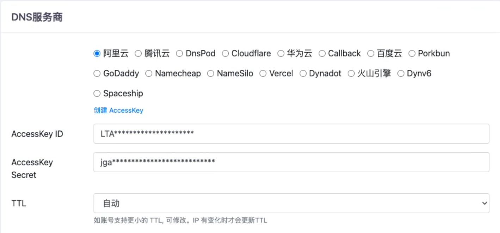
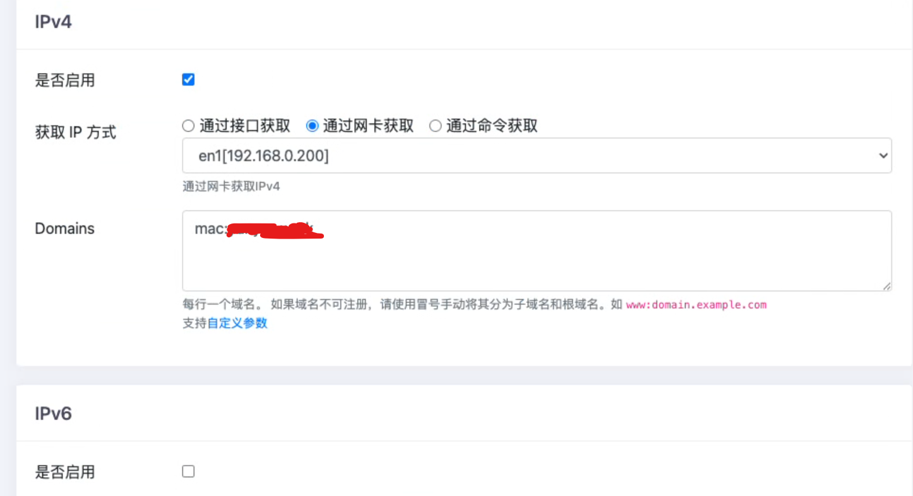
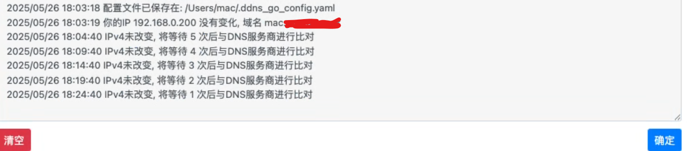

# DDNS部署

> 使用动态域名解析来解决IP地址不固定的情况，主机周期性检测IP地址变化情况，如果发生变化对DNS服务器解析记录进行修改

应用场景：

1. 公网使用，拥有IPv4公网地址或IPv6全球单播地址地址且支持并开启IPv6服务，基本是向运营商申请，由运营商分配地址，导致IP地址可能发生变化，可利用域名进行快速访问

2. 局域网使用，主机与域名进行绑定方便访问

<!-- more --> 

## ddns-go部署

> 此处是mac，其它配置查看官方文档

1. 下载文件到本机：https://github.com/jeessy2/ddns-go

2. 下载完成后解压进入文件夹，执行

   ```
   sudo ./ddns-go -s install
   ```

3. 执行完毕后服务已启动，可打开浏览器访问127.0.0.1:9876进行配置

4. 选择自己的DNS服务商，再填写AccessKey ID和AccessKey Secret，阿里云可通过accesskey获取，注意这两个值一定不能泄露，否则将会获得账户的完全控制权

   

   

5. 启用IPv4推荐IP获取为接口获取、IPv6推荐为网卡获取，根据需要进行更改，绑定的域名若已经存在则直接填写域名`www.example.com`，若子域名不存在则使用`www:example.com`，此处我用作局域网访问

   

6. 点击保存后可在右上角日志查看配置是否成功及运行情况，可通过命令来修改检测本地IP与向DNS服务器对比间隔，默认5分钟检测一次，5次后对比DNS服务器

   

7. 可以看到成功添加解析记录

   

8. VNC测试

   

   

