# IPv6获取

> 此实验建立在光猫工作在路由模式且天翼网关的基础上

<!-- more --> 

1. 查看电脑网关，登录路由器配置页面

   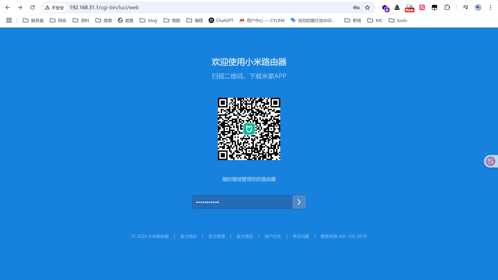

2. 输入密码登录后查看光猫工作模式，PPPoE为桥接模式，DHCP为路由模式（家用路由器一样用）

   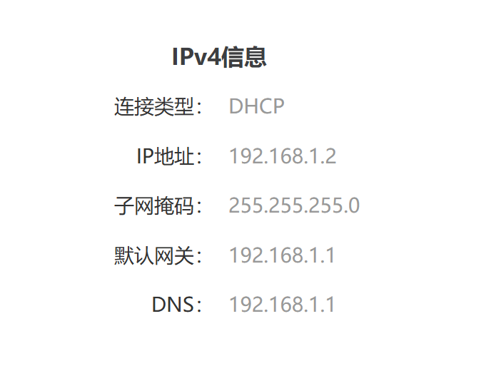

3. 通过网关地址访问光猫，输入密码后可对光猫进行简单配置，SSID，密码等信息标示于光猫背面，登录后还是无法网络设置，需要超级管理员账户telecomadmin权限，因此先得获取账户密码

   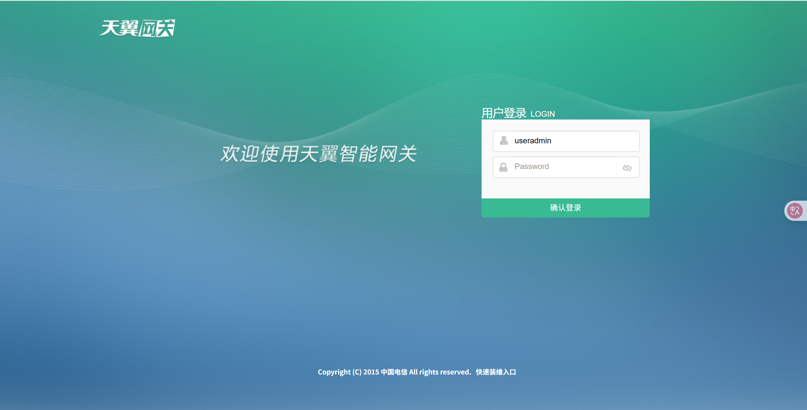

4. 在登录后的界面查看源代码，搜索`sessionKey`，将其添加在URL后，注意`sessionKey`具有一定时效性，刷新重新获取既可

   ```
   http://192.168.1.1:8080/usbbackup.cmd?action=backupeble&amp;enabled=0&amp;sessionKey=
   ```

   找到一个，结果访问的时候说不存在，于是找下一个

   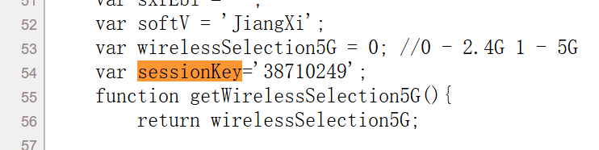

   成功找到

   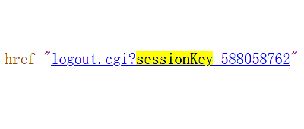

5. 访问成功后页面如下，光猫上插入u盘需要FAT32或者NTFS格式，点击备份配置

   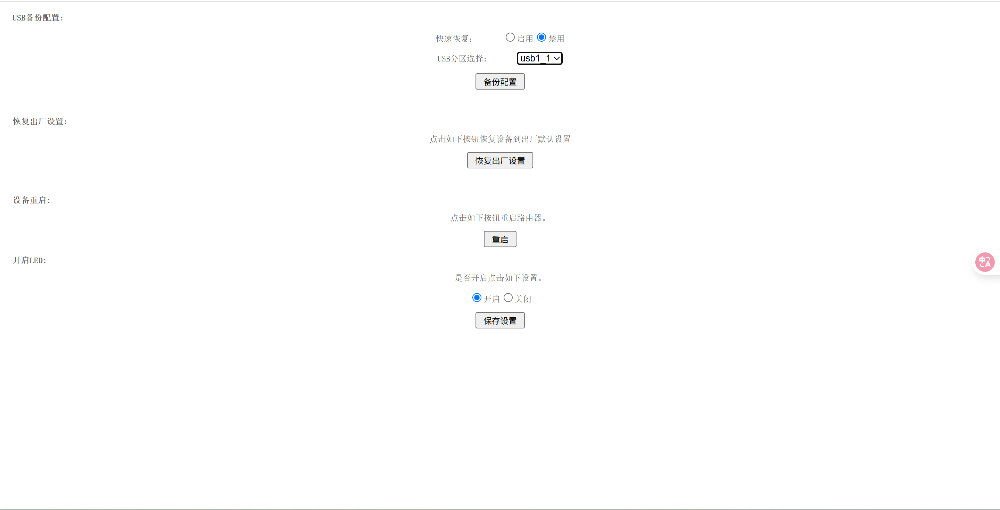

6. 保存成功后取下u盘查看，可看到配置文件，使用RouterPassView进行查看

   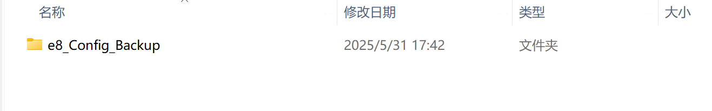

7. 查找TeleComAccount找到账户和密码

   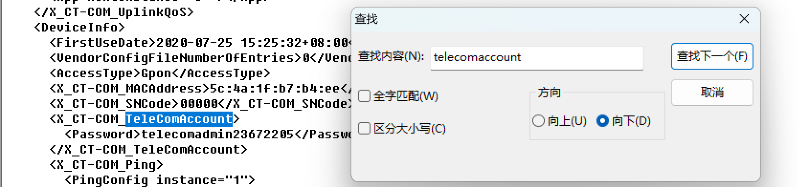

8. 登录成功，可对网络进行配置

   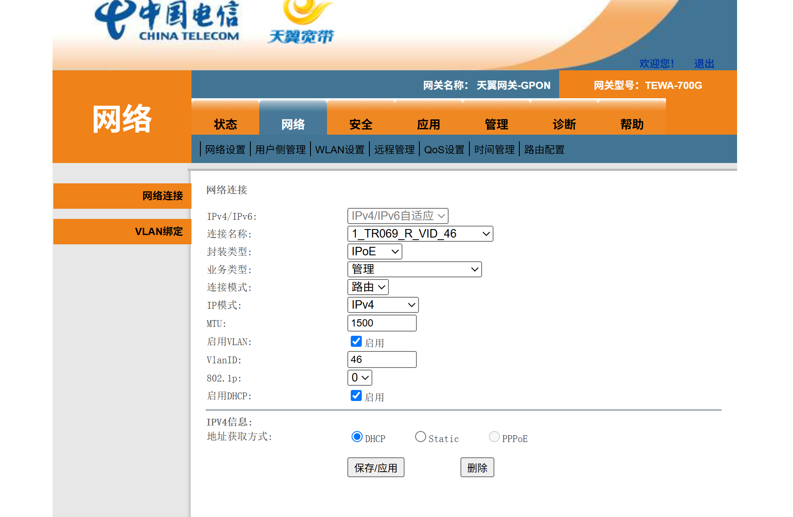

9.  修改网络配置

    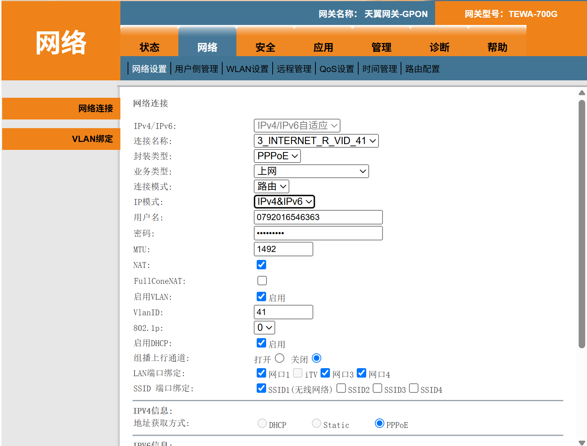

10. 查看网络状态，成功获取全球IPv6地址

    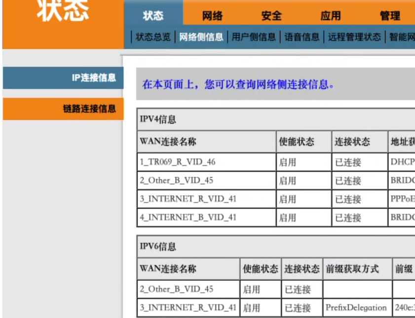

11. 测试连通性

    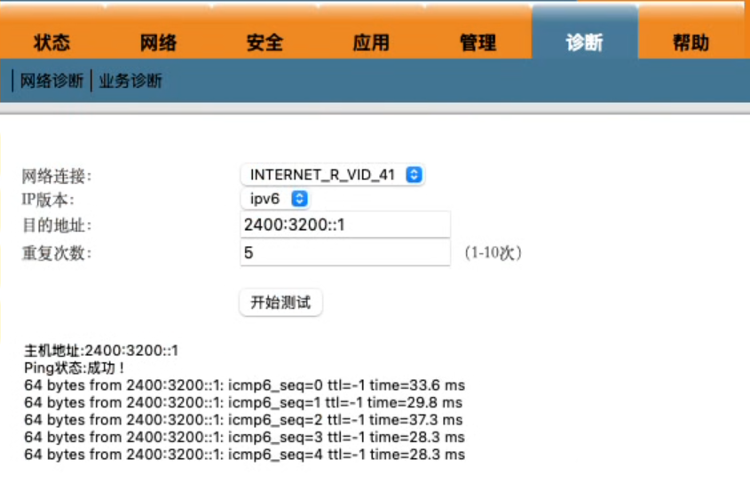

12. 填入获取到的前缀并开启dhcp

    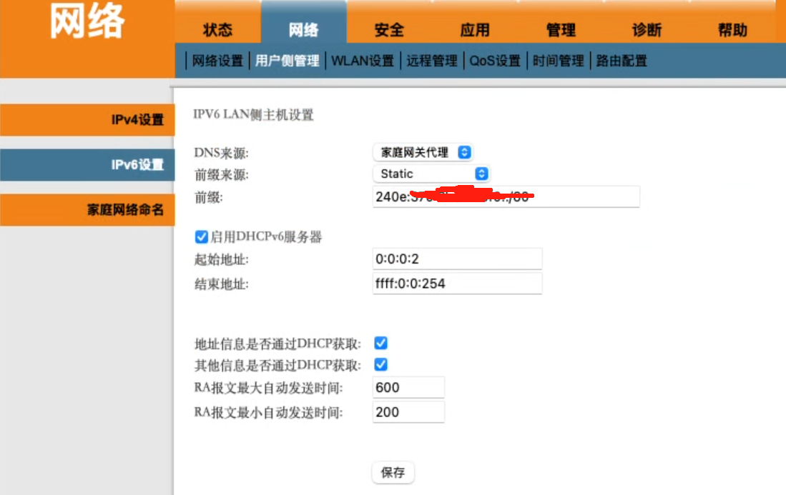

13. 查看主机ip获取情况，成功获取

    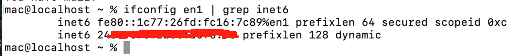

14. 测试ipv6网络是否可用https://ip.zxinc.org/ipquery/

    

