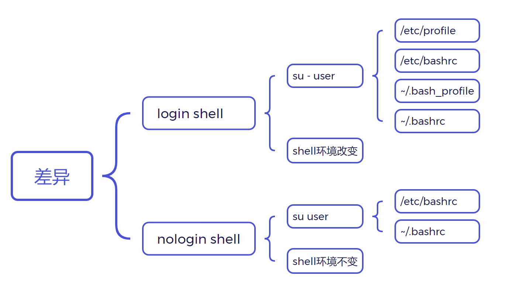

# Linux进阶-shell编程

> shell：介于用户和内核之间的工具，用户操作通过shell解析传递给内核
>
> 两种表现形式：交互式、脚本式
>
> 类型：bash（Linux默认）、ash、csh、ksh等

<!-- more -->

## 基本格式

```shell
#未指定解释器时生效,默认为bash
#! /bin/bash

#定向给pyton执行
python <<-EOF
print "hello world"
EOF

#执行语句
echo "hello world"
```

## 执行

> 无论是通过bash shell.sh还是./shell.sh都是在sub shell执行，不会影响当前shell，而使用. shell或source shell.sh则会在当前shell生效

## 特点

### 历史命令记忆

| 命令 | 作用                     |
| ---- | ------------------------ |
| !num | 执行编号命令             |
| !str | 执行最近一个搜索到的命令 |
| !$   | 上个命令最后参数         |
| !!   | 上个命令                 |
| ^R   | 搜索历史命令             |

### 命令别名

| 命令      | 作用                   |
| --------- | ---------------------- |
| alias     | 查看别名、临时命名别名 |
| unalias   | 取消别名               |
| \         | 跳过别名使用           |
| ~/.bashrc | 永久命名别名           |

### 快捷键

| 快捷键 | 作用             |
| ------ | ---------------- |
| ^R     | 搜索历史命令     |
| ^D     | 退出登录         |
| ^A     | 光标移动最前     |
| ^E     | 光标移动最后     |
| ^U     | 删除光标前内容   |
| ^K     | 删除光标及后内容 |
| ^Y     | 撤销             |
| ^S     | 不显示命令行     |
| ^Q     | 显示命令行       |
| ^V     | 块选择           |

### 通配符

| 符号                  | 作用                       |
| --------------------- | -------------------------- |
| *                     | 匹配任意字符               |
| ?                     | 匹配任意一个字符           |
| [123]、[1-3];[^1-3\] | 匹配范围内一个；不在范围内 |
| ()                    | 将命令在sub shell执行      |
| {1..3}、\{1,2,3\}       | 集合，按序取参             |

### 前后台进程控制

> screan工具：
>
> -S：定义一个会话名称，
>
> -list：查看会话列表，
>
> -r：继续会话

| 命令      | 作用                   |
| --------- | ---------------------- |
| &         | 后台运行               |
| nohup     | 使终端重启时后台还存在 |
| ^C        | 结束前台进程           |
| ^Z        | 前台作业暂停到后台     |
| jobs      | 查看作业状态           |
| bg PID    | 作业后台工作           |
| fg PID    | 作业回到前台           |
| kill %PID | 终结进程               |

### 颜色设置

* \e[1;30m：字体颜色30-37
* \e[1;40m：背景颜色40-47
* \e[0m：重置

## 变量

### 使用

* 引用变量：$，字符串中加{}或空格隔开
* 删除变量：unset
* 只读：readonly

### 类型

* 本地变量：脚本内部使用

* 环境变量：整个系统可使用

  > env：查看所有环境变量
  >
  > 修改：
  >
  > ​		系统：/etc/profile
  >
  > ​		用户：~/.bash_profile
  >
  > 导出：
  >
  > ```bash
  > export PATH=$PATH:/root/shell
  > ```
  >
  > 在脚本中一般无需设置环境变量，如需调用其他文件变量导出后. file引入

* 位置变量

  $数字：根据参数下标传参

* 预定义变量：

  | 变量   | 含义                              |
  | ------ | --------------------------------- |
  | $0     | 脚本文件名                        |
  | $*、$@ | 所以参数                          |
  | $#     | 参数个数                          |
  | $?     | 上次执行命令结果，0正确，其他错误 |
  | $!     | 上一个后台进程PID                 |
  | $$     | 当前进程PID                       |

### 字符串

* ${#变量}：字符串长度
* ${变量:开始:长度}：提取字符

### 数组

* 定义：declare，-a普通，-A关联

#### 普通数组

> （）

#### 关联数组

> （[key]=value）类似字典

### 提示符

* PS1：[\\u@\\h \\W]\\$
* PS2：>
* PS4：+

### 引用

> 基本引用格式：$、(())、${}、``

* ${temp#~}：从前删除特定内容后引用
* ${temp#*~}：删除到第一个特定内容处引用
* ${temp##*~}：贪婪匹配
* ${temp%~}：从后匹配删掉特定内容
* ${temp%~*}：删除到第一个特定内容处引用
* ${temp%%~*}：贪婪匹配
* ${temp:n:m​}：切片引用

* ${temp/oldstr/newstr}：内容替换引用
* ${temp//oldstr/newstr}：贪婪匹配

### 默认赋值

* res=${a-b}：a未定义时取b
* res=${a=b}：同-；但还会赋值给a
* res=${a+b}：与-相反
* res=${a?b}：a未定义把b输出到标准错误中，并退出脚本

> 加 : 空值也生效

## 运算

> 测试工具test，成功结果为0，失败为1，$?查看
>

### 数值比较

| 命令 | 判断 |
| :--: | :--: |
| -lt  |  <   |
| -le  |  <=  |
| -gt  |  >   |
| -ge  | \>=  |
| -ne  |  !=  |
| -eq  |  =   |

### 字符串比较

| 判判断断命令 |   运算    |
| :----------: | :-------: |
|      =       |     =     |
|      !=      |    !=     |
|      -n      | 长度不为0 |
|      -z      |  长度为0  |
|      =~      | 正则判断  |

> 字符串比较需加引号防止空值绕过

### 文件判断

| 命令 |     判断     |
| :--: | :----------: |
|  -f  |     文件     |
|  -d  |     目录     |
|  -w  |     可写     |
|  -x  |    可执行    |
|  -s  |    不为空    |
|  -c  | 字符设备文件 |
|  -b  |  块设备文件  |
|  -L  |     链接     |
|  -e  |     存在     |

### 逻辑判断

|   命令   | 判断 |
| :------: | :--: |
|  -a、&&  |  与  |
| -o、\|\| |  或  |
|    !     |  非  |

## 流程控制

### read输入

| 参数 | 作用         |
| ---- | ------------ |
| -p   | 打印         |
| -t   | 等待时间     |
| -n   | 限制输入长度 |

### if分支结构

> ：不做处理

```shell
#! /bin/bash

read -p "please input two number:" a b

if [ $a -ge $b ];then
	echo "right"
elif [ $a -ne $b ];then
	echo "error"
else
	echo "what this?"
fi
```

### case分支结构

> 字符串比较

```shell
#! /bin/bash

read -p "please input a char:" str

case $str in
[a-z])
	echo "alpha"
;;
[0-9])
	echo "number"
;;
*)
	echo "others"
;;	
esac
```

### select循环结构

```shell
#!/bin/bash

select i in a b quit
do
	case $i in
	a)
		...
	;;
	b)
		...
	;;
	quit)
		break
	;;
	*)
		exit
	esac
done
```

### for循环结构

> IFS设定分割符，默认空格、Tab、\n分割，不用处理空行

```shell
#! /bin/bash

#遍历
for i in a b /*
do
	echo $i
done
```

```shell
#! /bin/bash

#打印1到5
for ((i=1;i<=5;i++))
do
	echo $i
done
```

```shell
#!/bin/bash

#遍历所有参数
for i	#默认接收参数
do
	echo $i
done
```

### while循环结构

> <读入，默认\n分割，要处理空行

```shell
#! /bin/bash

#读取文件每行
while read line
do
	echo $line
done <test.txt
```

```shell
#!/bin/bash

while [ $# -ne 0 ]
do
	let sum+=$1
	shift #位置变量左移
done
echo $sum
```

### until循环结构

```shell
#! /bin/bash

#打印1到5
i=1

until [ $i -gt 5 ]
do
	echo $i
	((i++))
done
```

## 函数

```shell
#! /bin/bash

demo(){
	read -p "输入两个数:" a b
	local sum=$((a+b))
	#return $sum
	echo $sum
}
#demo
#echo $?
result=`demo`
echo $result
```

> return最多255
>
> 局部变量local

## 调试

* sh -n shell.sh：检查语法错误
* sh -vx shell.sh：查看执行过程

## 特殊命令

* seq m n：生成m到n正数
  * -w：等位补齐
* expr：
  * 整数运算：expr 1 + 1
  * 字符串长度：expr length " "
  * 截取字串：expr substr " " m n
  * 第一个字符出现位置(非下标)：expr index " " s
* basename：显示路径最后文件名
* dirname：最后目录名
* watch：持续监视命令结果
  * -n：间隔
  * -d：高亮显示变化

## 重定向

> *打开任意程序，系统自动创建三个文件流：输入(0)、输出(1)、错误(2)被指定到终端*

* \>：输出重定向

  * \>>：追加

* 2>：错误重定向

* &>：同时重定向

* > 程序 <<-EOF     #定向执行，-忽略结束标志缩进问题
  >
  > #内容
  >
  > EOF     #结束标志
  >
  > #EOF可自定义，只作为标记

## 管道

### 匿名管道

* |：前命令输出为后命令输入
* |tee 文件：将结果输出到文件，-a追加

> *命令不接受管道参数时使用xargs*

### 命名管道

> 可跨终端使用

* mkfifo 文件：创建管道

## 文件描述符(句柄)

> FD：File Descriptors

* ll /proc/{PID}/fd：查看进程FD

* exec 文件描述符<> 文件：指定FD打开文件
* exec 文件描述符<&-：关闭文件，释放FD

> 文件被删除但FD未释放数据仍存在

## 并发控制

> 进程数量太过庞大对其进行限制

```shell
#! /bin/bash

tmpf=/tmp/$$.fifo
mkfifo $tmpf
exec 6<> $tmpf
rm $tmpf
for i in `seq 10`
do
	echo >&6
done

for i in {1..999999}
do
	read -u 6 #读取标识符中内容
	{
		...
		...
		echo >&6 #当一个后台执行结束时对标识符内容进行扩充
	}&
done

exec 6<&-
```


## 相关文件

### 系统级

* /etc/profile：全局环境
* /etc/bashrc：局部环境

### 用户级

* ~/.bash_profile：全局环境
* ~/.bashrc：局部环境
* ~/.bash_logout：退出后执行命令
* ~/.bash_history：退出后记录历史命令



### 黑洞文件

> 所有经黑洞文件数据都为空，路径/dev/null

* 任意内容屏蔽输出和错误

  ```bash
  ping www.baidu.com &>/dev/null
  ```

* 清空文件

  ```bash
  cat /dev/null > 文件
  ```
  
  ```bash
  echo "cat /dev/null >~/.bash_history" >>~/.bash_logout
  ```

## 正则表达式

### 基本元字符

| 元字符     | 功能                             |
| ---------- | -------------------------------- |
| ^、$       | 开头、结尾                       |
| .          | 单个字符                         |
| ab*c       | b出现0到多次                     |
| .*         | 任意字符                         |
| []         | 范围内一个字符                   |
| [^]        | 不在范围内                       |
| \\<、\\>   | 词开头、词结尾                   |
| \\(a\\)    | 定义a标签，\num调用，num为标签号 |
| ab\\{n\\}c | b出现n次                         |

### 扩展元字符

| 元字符   | 功能          |
| -------- | ------------- |
| ab+c     | b至少出现一次 |
| ab?c     | b出现0或1次   |
| abc\|ef  | abc或ef       |
| (a)      | a标签         |
| ab\{n\}c | b出现n次      |

### POSIX字符

| 表达式    | 功能         |
| --------- | ------------ |
| [:alnum:] | 字母和数字   |
| [:alpha:] | 字母         |
| [:blank:] | 空格、Tap    |
| [:digit:] | 字母数字     |
| [:lower:] | 小写字母     |
| [:upper:] | 大写字母     |
| [:punct:] | 标点符号     |
| [:space:] | 所有空白符号 |


## 文本处理

### grep

> grep、egrep、fgrep
>
> 格式：grep [参数] '正则匹配' 文件
>
> 返回值：找到0、没找到1、文件不存在2

| 参数 | 功能                     |
| ---- | ------------------------ |
| -q   | 不显示匹配内容           |
| -E   | egrep                    |
| -v   | 反向查找                 |
| -i   | 忽略大小写               |
| -r   | 递归，针对目录           |
| -B   | 显示匹配项前几行         |
| -A   | 显示匹配项后几行         |
| -C   | 显示匹配项上下几行       |
| -I   | 只显示匹配项所在文件名   |
| -n   | 显示匹配项在文件中的行号 |
| -c   | 找到1，没找到0           |

| 匹配 | 功能      |
| ---- | --------- |
| \w   | [a-Z0-9]  |
| \W   | [^a-Z0-9] |
| \b   | \\<、\\>  |


### sed

> 格式：sed [参数] '指令' 文件
>
> 返回值：都为0，语法错误非0

| 参数 | 功能                    |
| ---- | ----------------------- |
| -n   | 结合p使用，用于打印内容 |
| -i   | 会对文件进行修改        |
| -r   | 支持扩展元字符          |
| -e   | 多重编辑                |

#### 打印p

| 指令 | 功能       |
| ---- | ---------- |
| 'np' | 打印第n行  |
| '$p' | 打印最后行 |

#### 删除d

| 指令         | 功能              |
| ------------ | ----------------- |
| 'nd'         | 删除第n行         |
| 'm,nd'       | 删除m到n行        |
| '/正则/,nd'  | 从匹配项删到第n行 |
| '/正则/,+nd' | 从匹配项向下删n行 |
| '/正则/!d'   | 删除非匹配行      |
| 'm~nd'       | m行开始隔n行删    |

#### 添加a

| 指令       | 功能           |
| ---------- | -------------- |
| 'na内容'   | 第n行下添加    |
| 'm,na内容' | m到n行下都添加 |

#### 覆盖c

| 指令       | 功能       |
| ---------- | ---------- |
| 'nc内容'   | 取代第n行  |
| 'm,nc内容' | 取代m到n行 |

#### 插入i

> 同a在行前添加

#### 替换s

| 指令           | 作用                   |
| -------------- | ---------------------- |
| 's/旧/新/'     | 替换一个               |
| 's/旧/新/g'    | 替换所有内容           |
| 's/旧/新/gi'   | 忽略大小写替换所有内容 |
| 'm,ns/旧/新/g' | 对m到n行内容进行替换   |
| 's/.*/&abc/'   | 行尾加abc              |

#### 下一行n

* '/root/{n;d}'：删除root下一行

#### 读文件r

| 指令          | 作用               |
| ------------- | ------------------ |
| 'nr文件'      | 到第n行下读入文件  |
| '/正则/r文件' | 到匹配行下读入文件 |

#### 写文件w

| 指令          | 作用             |
| ------------- | ---------------- |
| 'nw文件'      | 将第n行写入文件  |
| '/正则/w文件' | 将匹配行写入文件 |

> /作为分隔符可替换，以@为例：'\\@abc@'，'s@abc@cba@'

#### 暂存空间

> 本身含有空行

* h、H：存入

* g、G：取出

> 小写覆盖，大写追加
>
> 反转：sed -r '1!G;$!h;$!d'，先将内容分别读入模式空间再进行操作
>
> 

* x：交互暂存空间、模式空间

### awk

> 格式：awk [选项] '/正则/{指令}' 文件
>
> 支持条件判断，循环，数组等操作

| 选项 | 功能       |
| ---- | ---------- |
| -F   | 设定分割符 |
| -v   | 定义变量   |

#### 处理流程

* BEGIN{}：行处理前执行

| 变量 | 功能                   |
| ---- | ---------------------- |
| FS   | 字段分割符             |
| OFS  | 输出字段分割符         |
| RS   | 记录分割符，一分多     |
| ORS  | 输出记录分割符，多合一 |

* {}：行处理

| 变量 | 功能         |
| ---- | ------------ |
| $0   | 完整记录     |
| NR   | 总行号       |
| FNR  | 当前文件行号 |
| NF   | 字段数       |

* END{}：行处理后执行

#### 格式化输出

* print

* printf：可定义格式

#### 正则匹配

* 行：'/  /'、'!/  /'
* 列：\~、!\~

#### 函数

* length()：长度
* sub()：替换一个
* gsub()：全部替换
* int()：取整数部分

#### 变量引用

> 双引号内：awk "gsub(/a/,\\"$b\\")"
>
> 单引号内：awk 'gsub(/a/,'''$b''')'、'gsub(/a/,"'"$b"'")'
>
> awk内部定义：awk -v b=c 'gsub(/a/,b)'

### sort

| 参数 | 功能           |
| ---- | -------------- |
| k    | 按指定列排序   |
| n    | 数值从大到小排 |
| r    | 逆序排         |


## 计划任务

* crontab -e：设定任务