# Web安全简介

d2Vi5a6J5YWo

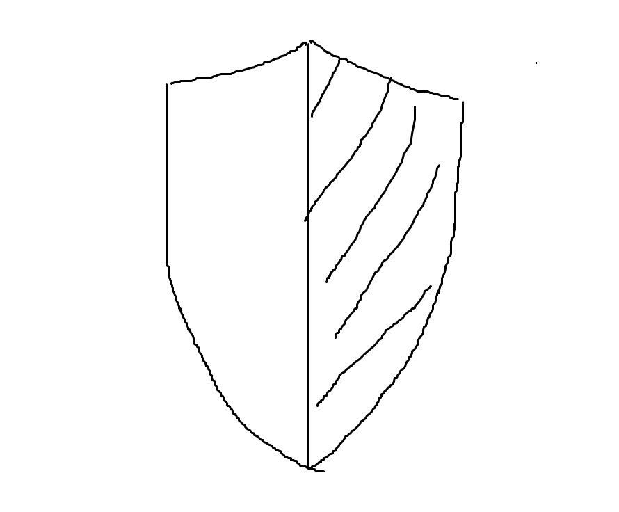

<!-- more -->

## HTTP协议

> Client-Server协议，只能由客户端发起服务器响应，浏览器作为用户代理发送请求

### HTTP请求

> HTTP头格式、个数、顺序会有差别
>
> 1. 不同代理
>
> 2. 同一代理访问不同资源
> 3. 不同场景

| 方法    | 功能                              |
| ------- | --------------------------------- |
| OPTIONS | 向服务器询问是否支持特定选项      |
| GET     | 获取URI指定资源                   |
| HEAD    | 与GET类似，但服务器不返回实际内容 |
| POST    | 向服务器提交数据                  |
| PUT     | 向指定URI存储文件                 |
| DELETE  | 删除URI指定的文件                 |
| TRACE   | 让服务器回显客户端请求内容        |
| CONNECT | 建立代理隧道                      |

注意事项：

* 安全操作时既只读，使用GET或HEAD；有副作用操作时使用POST，如提交用户信息
* PUT和DELETE用于直接的文件上传与删除，容易被利用产生安全问题，若无业务需求应被禁用
* 敏感信息使用POST而不是GET，否则URL被多种方式记录造成信息泄露
* TRACE在生产环境中应被禁用，XSS攻击可利用其绕过Cookie的HttpOnly策略
* HEAD可被DDos攻击利用，HEAD与GET所消耗服务端计算资源一样，而HEAD所消耗服务端网络出方向带宽较少，不会超过警阈值，计算资源却被耗尽
* Web服务器支持CONNECT时，可建立外网穿透内网的通道

### HTTP响应

> 响应与请求大版本号要一致

| 状态码  | 说明                 |
| ------- | -------------------- |
| 100~199 | 请求成功但未完成操作 |
| 200~299 | 响应完成             |
| 300~399 | 跳转                 |
| 400~499 | 客户端请求错误       |
| 500~599 | 服务端出错           |

> 漏洞：响应头以"\\r\\n"分割，当请求内容出现在响应头将可注入

### 版本

* HTTP/1.0：

  * 组成：

    1. User-Agent：访问者客户端类型

    2. Referer：发起请求的URL

  * 漏洞：

    1. User-Agent中插入XSS Payload对后台日志分析平台盲打
    2. 旧版本Flash可伪造Referer，现只可修改为同源
* HTTP/1.1：

  * 新增：
    1. 一个TCP连接可完成多个HTTP请求
    2. 支持管线化，客户端无需等待上一个请求，服务端按序回应
    3. HOST：物理机多个虚拟机共用一个IP，HOST传递主机名；1.0一个服务器对应一个IP
    4. Keep-Alive：长连接减少多次连接延迟，1.0短连接自动断开
    5. Range：请求部分资源，避免返回完整资源造成资源浪费，返回码206
    6. Content-Length：请求体长
    7. Transfer-Encoding：请求体长不可预估
  * 漏洞：
    1. HTTP Flood可利用少量的TCP发送大量HTTP请求
    2. 当没有明确配置网站域名时，可被XSS利用
* HTTP/2：

  * 新增：
    1. 多路复用：解决1.0先进先出拥塞问题
    2. 数据流：每个请求对应的所有数据包为一个数据流，ID标识，解决无序问题
    3. 优先级：提高重要请求优先级
    4. 头部压缩：头部信息重复用索引代替，采用哈夫曼编码
    5. 推送：服务器可以将未请求的静态资源随主页推送
    6. 不再以文本格式传输而是二进制
    7. 伪头：:authority、:methed、:path、:scheme、响应:status
    8. 帧长固定，废除Content-Length和Transfer-Encoding
* HTTP/3：部分应用底层HTTP库未升级，支持网站不多
  * 新增：
    1. 不再使用TCP，改用UDP的QUIC协议，实现TCP类似功能的同时，还能随应用更新快速更新协议，根据需求选择QUIC库
    2. 使用64比特随机数为连接ID，不会因为IP改变导致连接中断
    3. 限制了客户端首包大小，并对响应包证书压缩，减小放大比例，返回数据量最多为客户端3倍
  * 漏洞：
    1. 大部分安全产品不支持QUIC会将HTTP/3作为普通UDP处理
    2. 服务端响应首包包含TLS证书使其远大于请求包，实现UDP反射放大攻击

## Web基础

### 代理

正向代理：客户端指定代理

反向代理：服务端CDN、WAF、负载均衡

### 结构

DOM(文本对象模型)树状结构

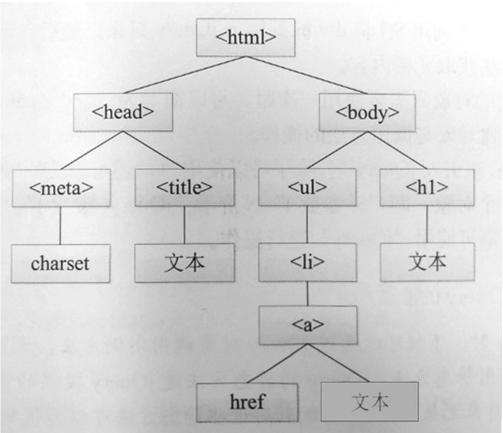

### 动态交互

JavaScript：动态类型语言，现代浏览器唯一操作DOM的编程语言，不利于编写大型复杂应用

TypeScript：JavaScript超集，支持静态数据类型，更好的面向对象开发，可编译为JavaScript在浏览器运行

## 浏览器安全

### 同源策略

限制JavaScript不能读取和操作其它源资源，可展示执行其他源资源但不能获取详细数据

> 同源：协议+主机名+端口相同

#### 跨域DOM互访

##### document.domain

> 将网页中document.domain修改为同源

1. 只可修改为当前域名或父域
2. 修改后端口号为null，端口限制将可绕过
3. 需修改当前和子域才可生效，端口都为null

| URL                | 当前页面document.domain | iframe中URL             | iframe页面document.domain | 结果     |
| ------------------ | ----------------------- | ----------------------- | ------------------------- | -------- |
| https://www.abc.cn | abc.cn                  | https://www.abc.cn:8080 | abc.cn                    | 允许访问 |
| https://www.abc.cn | abc.cn                  | http://www.abc.cn       | abc.cn                    | 禁止访问 |
| https://www.abc.cn | abc.cn                  | https://www.abc.cn      |                           | 禁止访问 |
| https://www.abc.cn | abc.cn                  | https://www.abc.cn      |                           | 禁止访问 |

* 漏洞：子域安全性对当前域名影响极大

##### window.name

> 窗口window.name设置后跨域仍然保留

* 漏洞：访问恶意网站将泄露敏感数据，因此部分浏览器跳转时置空属性值

##### window.postMessage

> 窗口之间发送消息，可指定接收源与发送源

* 漏洞：未对源进行验证则易被攻击

#### 跨域访问服务端

##### JSONP

> 跨域执行JavaScript代码不受限制，只支持GET请求

###### 方式

1. 对JSON数据前后进行填充使其变为JavaScript代码

   > 提前定义好回调函数再通过\<script src="JSONP地址">\</script>载入代码

2. 将JSON数据赋值变量

###### 漏洞

1. 任何网站都可载入JSONP获取其中数据，JSONP劫持、只读型CSRF

   > 方案：严格检验Referer确保可信或使用随机Token

2. 可不发送Referer，通过Referrer-Policy头或\<script>标签中加上referrerPolicy="no-referrer"

   > 方案：服务端拒绝不带Referer头的JSONP请求

3. 恶意构造回调函数

   > 方案：响应头设置Content-Type为application/javascript

4. 开发人员在无需跨域接口加上了JSONP需求，在URL添加参数"callback=func"或修改参数"format=json"、"format=xml"为jsonp将造成JSONP劫持

##### 跨域资源共享CORS

###### 类型

* 简单请求：浏览器发送请求带上Origin头，服务端返回指示可访问源，浏览器以此判断请求是否成功

  > HTML表单提交请求，如GET、HEAD、POST

  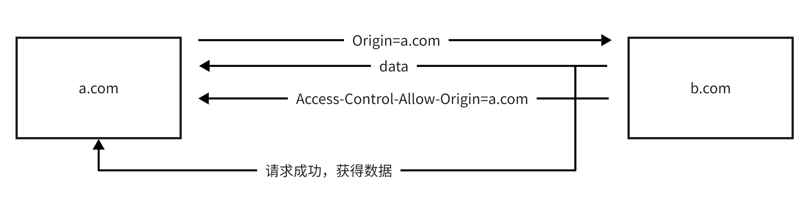

* 复杂请求：发送请求前浏览器OPTIONS方法发送预检请求，服务端允许后发送请求

  > 请求方法可能对服务器产生副作用时

  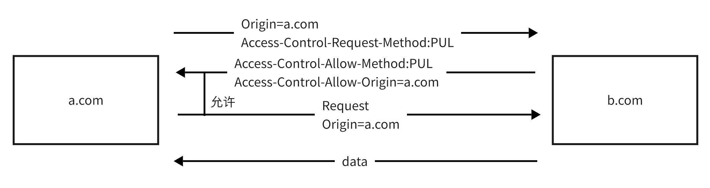

###### 请求头

Origin：当前源

Access-Control-Request-Method：需要的使用方法

Access-Control-Request-Headers：需要用到的HTTP头

###### 响应头

Access-Control-Allow-Method：允许方法

Access-Control-Allow-Headers：允许头

Access-Control-Allow-Origin：允许源，为“ * ”则不允许携带凭证信息，为“ null ”则影响Origin为null

> 漏洞：
>
> 1. 为null则任意本地文件、恶意网站Data URL、沙盒化iframe载入的页面都能访问当前源
> 2. 开发人员调用请求中的Origin构建并允许携带凭证信息

Access-Control-Allow-Credentials：能否携带凭证信息

##### 私有网络访问

> 浏览器根据IP划分网络区域：公共网络、私有网络、本地设备，向私密性更高网络区域发起预检请求

##### WebSocket

###### 特点

1. 全双工通信
2. 防火墙一般放行
3. 使用长连接，认证通过后无需携带凭证

###### 漏洞

1. 不受同源策略约束

   > 方案：检验请求头Origin是否在白名单

2. CSRF

   > 为会话随机分配Token，握手检验Token是否正确

### 多进程架构

单个页面或组件崩溃不会影响浏览器

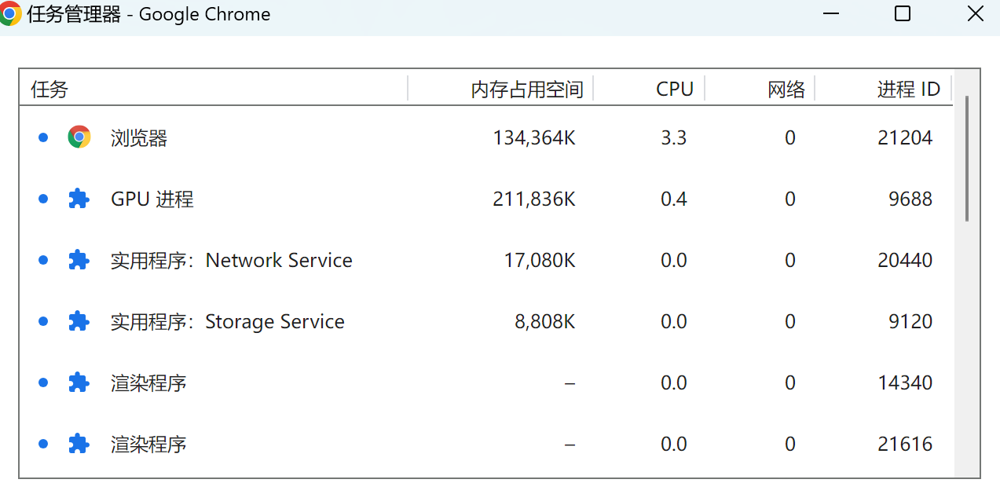

### 沙盒机制

将不可信代码在隔离环境运行，防止漏洞进一步被利用，如需调用外部数据需经API严格检测

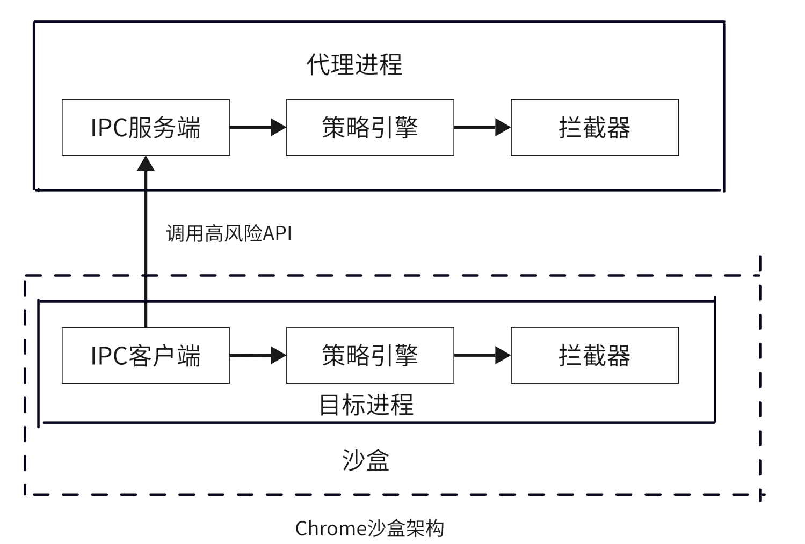

站点隔离：不同站点放在不同进程中渲染，即不同沙盒中

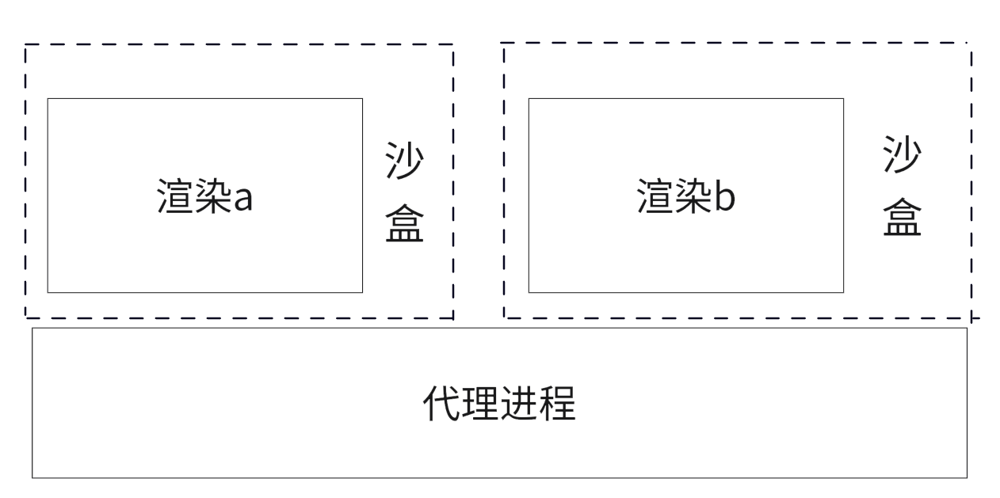

### XSS保护

黑名单：检测请求中是否含有可疑代码，并检测响应中是否含有相同代码

* XSS Filter：微软
* XSS Auditor：Chrome、Safari

白名单：明确指定哪些资源可信允许加载

* CSP：Firefox

CSP：服务端返回一个含有Content-Security-Policy的HTTP头，描述应当遵守的策略，由浏览器执行，主流浏览器都支持

### 隐私策略

1. P3P：网站声明采集用户数据类型与用途，与用户浏览器设定策略进行对比判断是否符合要求

   > 废弃原因：缺乏监管，网站主没有义务声明详细，用户操作门槛高

2. DNT：用户设置浏览器表明自己不希望被追踪

   > 废弃原因：缺乏监管，没有规定合理追踪程度，影响收益

3. GPC：由法律强制执行标准

   > 未全面实施

4. DoH：通过HTTPS进行域名解析，数据加密

   > 漏洞：封禁提供服务IP回退DNS

5. DoT：与DoH类似，端口853

   > 漏洞：封禁端口回退DNS

Safari：周期性删除追踪Cookie，可使用代理IP防止IP追踪

Chrome：隐私沙盒，用户隐私由浏览器接管，网站通过API调用，废除第三方Cookie

Brave：修改提供指纹的API，使不同系统类似或每次结果随机

### 恶意拦截

Safe Browsing：谷歌、Firefox、Safari；拦截恶意网站与程序

SmartScreen：微软；拦截恶意网站与程序，提供高信誉文件名单

EV SSL证书：不仅验证域名所有权，还对申请者身份真实性进行检验，高信誉用户通过

### 密码检测

检验密码强度，与已泄露的密码库比对

### 域名防护

对于某些域名转换为域名代码显示，防止域名同形异义词攻击

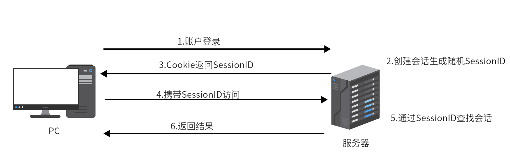

## Cookie

第一方Cookie：网站直接植入，用于标识用户身份

第三方Cookie：网站插入另一个网站内容，用于追踪访问者偏好分析投递广告

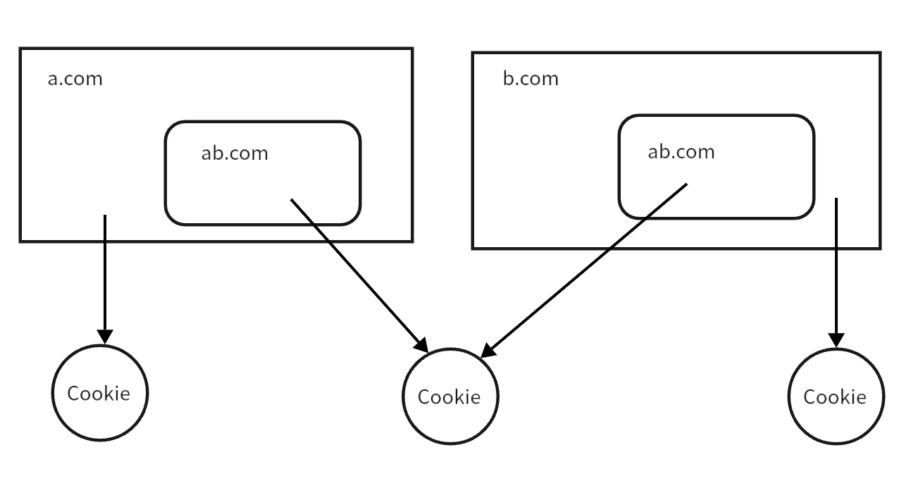

### 属性

#### Domain

> 指定Cookie生效域名

* 特点：

  1. ”.“开头对当前域名与子域名生效，目前主流浏览器不带也在子域生效

  2. 服务端Set-Cookie写入Cookie，默认只对当前域名生效，即Host-Only Cookie；客户端JavaScript写入只能指定当前或父域名

* 漏洞：

  1. 不包含端口信息，域名隔离不受端口限制，可能从应用泄露Cookie

#### Path

> 指定Cookie生效路径

* 特点：

  1. 在当前和子路径生效，默认当前路径

* 漏洞：

  1. 同源下DOM可互访，一个页面可以读取另一个路径页面Cookie

     ```
     <iframe id="test" src="/admin/" width=0 height=0></frame>
     <script>
     window.onload=function(){
     	alert(document.getElementById('test').comtentDocument.cookie);
     }
     </script>
     ```

#### Expires

> Cookie有效期

* 特点：
  1. 到期删除Cookie，默认关闭浏览器删除
  2. 浏览器恢复上次关闭页面变相将临时Cookie变为永久Cookie
* 漏洞：
  1. 超过浏览器对该站点的最大Cookie数时会删除旧Cookie

#### HttpOnly

> Cookie只能在HTTP/HTTPS传输

* 特点：
  1. JavaScript无法读取Cookie
* 漏洞：
  1. 通过调试或报错回显信息

#### Secure

> Cookie只能HTTPS传输

* 特点：
  1. 非加密传输设置失败

#### SameSite

> 跨站是否携带Cookie，写入与带出

* None：不做限制，要求带有Secure
* LAX：默认配置，链接到其他网站、GET方法携带Cookie
* Strict：禁止跨站携带

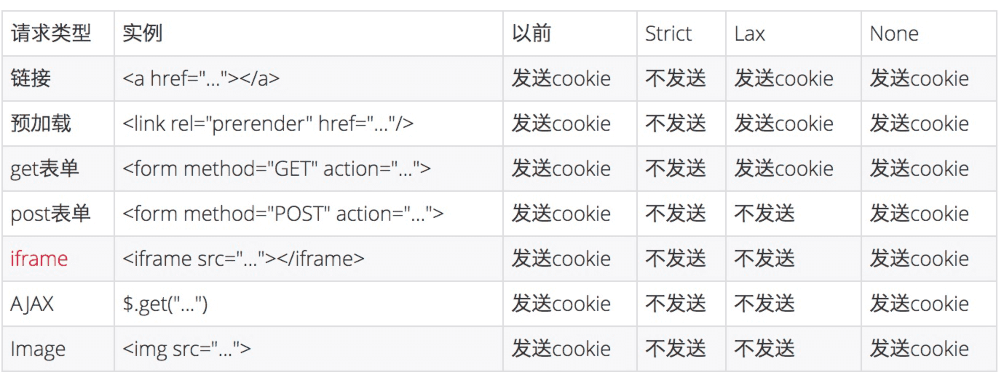

公共后缀列表：https://publicsuffix.org

#### SameParty

> 多个网站定义为一个可信站点集合，同一集合可携带Cookie

* 特点：
  1. 集合定义在/.wll-known/first-party-set中
  2. 目前只有Chrome支持

### 安全使用

#### 属性设置

1. 在HTTPS应用中设置Secure
2. 无需子域名读取Cookie时不设置Domain；如需读取则评估子域安全性
3. 重要Cookie设置HttpOnly
4. 明确指定SameSite

#### Cookie前缀

* __Host-：Cookie需满足条件浏览器才会接收：1.带有Secure；2.不包含Domain；3.HTTPS连接；4.Path为“/”，部分浏览器无需指定
* __Secure-：限制条件：1.带有Secure；2.HTTPS连接

#### 保密性与完整性

1. 尽量将不同应用部署与不同子域名，并使用Cookie前缀绑定域名

2. 不将重要数据写入Cookie，写入应当加密或签名

## 会话安全

### 会话管理

1. 会话ID随机：SessionID完全随机且长
2. 过期与失效：由服务端定义会话的过期时间和标记失效SessionID
3. 绑定客户端：会话与User-Agent、IP等绑定
4. 安全传输：避免Cookie泄露
5. JWT：客户端存储会话，服务端对Token进行验证，但有效期只能在服务端发放时设置，且密钥泄露将可签发任意账号JWT

### 固定会话攻击

> 给访问者新的SessionID，将杜绝固定会话攻击

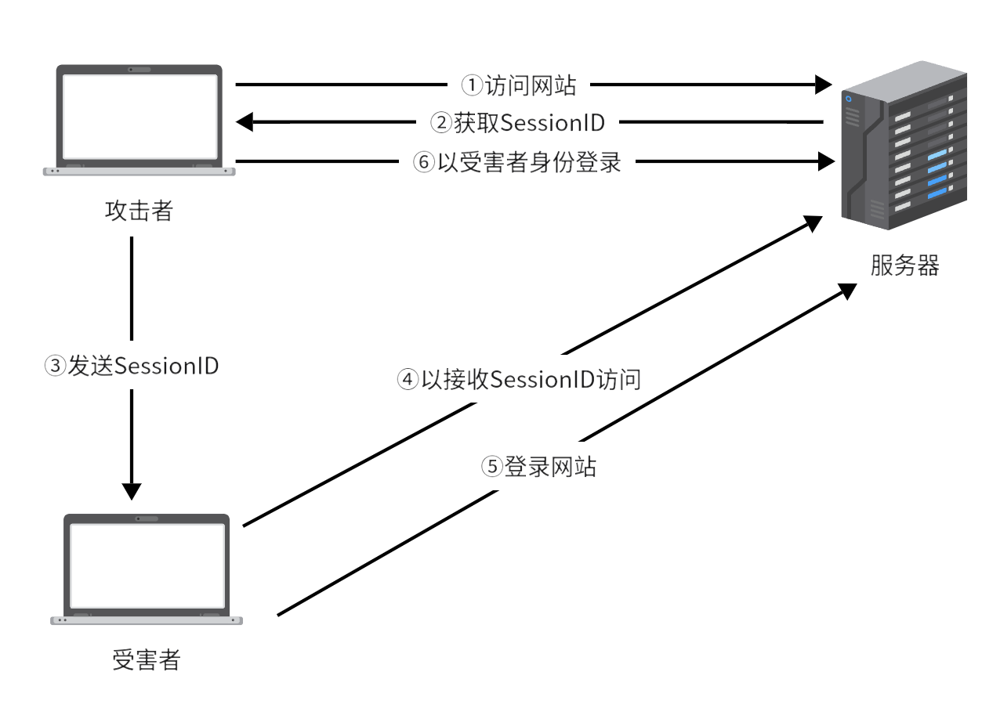

