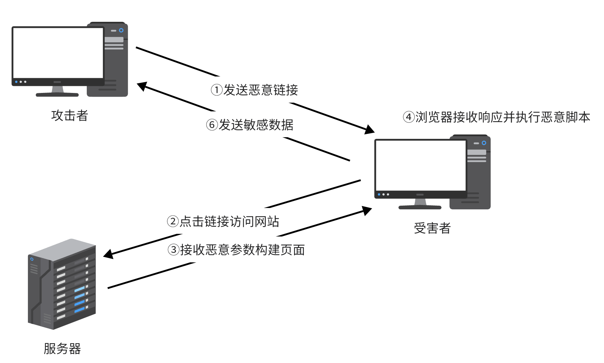
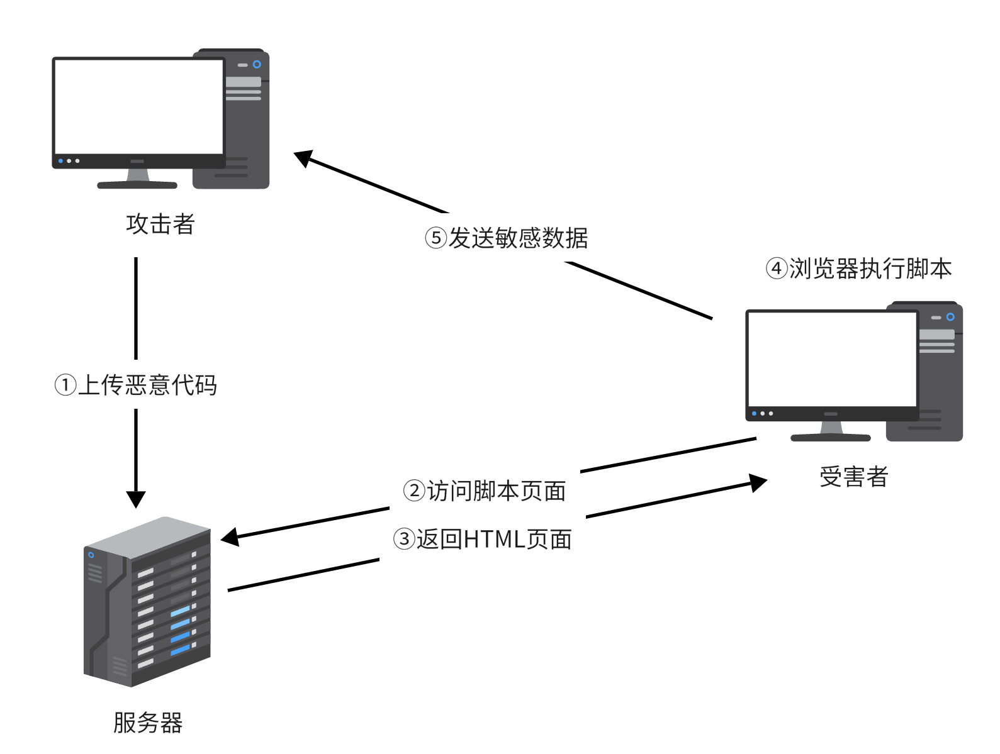
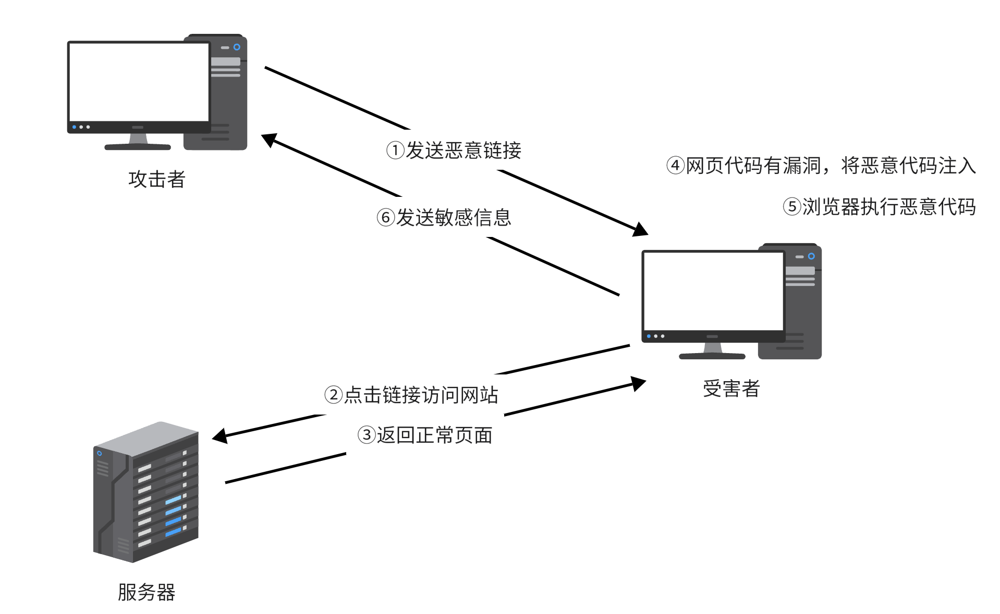

# Web攻防

d2Vi5pS76Ziy

<!-- more -->
## XSS攻击

> 向目标站点注入脚本

### 类型

#### 反射型

> 服务端将请求中参数直接用于构建HTML页面

#### 存储型

> 向服务端提交恶意代码并存储在服务端

> 若Cookie被输出到HTML页面，则可向受害者Cookie注入恶意代码

#### DOM型

> 前端代码漏洞，客户端JavaScript脚本操作DOM节点时触发恶意代码

#### Self-XSS