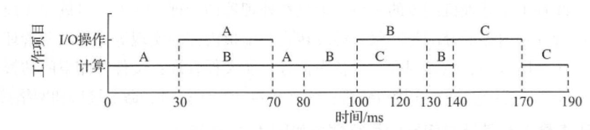

# 计算机操作系统概述

* 用户与计算机硬件系统之间的接口

* 计算机系统资源的管理者
* 实现对计算机资源的抽象

<!-- more -->

## 发展与分类

### 人工操作

> 通过纸袋打孔编写程序

缺点：

1. 用户独占全机
2. 人机速度矛盾导致资源利用率极低

### 单道批处理系统

> 引入脱机输入/输出技术，由监督程序控制，按顺序连续处理程序
>
> 脱机输入/输出：将纸带上数据输入到磁带上，CPU需要时高速调用，输出时再高速输送至磁带

改善：

1. 减少了CPU空闲时间
2. 提高了I/O速度

缺点：

1. CPU利用率较低

### 多道批处理系统

> 多道程序并发执行

非抢占式：完整执行进程某一阶段

抢占式：按绝对次序执行

改善：

1. 资源利用率提高
2. 系统吞吐量大

缺点：

1. 平均周转时间较长
2. 无交互能力

### 分时操作系统

> 以时间片为单位轮流为用户服务

特点：

1. 多路性：允许多个用户共享一台计算机
2. 独立性：每个用户之间互不干扰
3. 及时性：在极短时间内获得响应
4. 交互性：人机交互

缺点：

1. 不能优先处理紧急任务

### 实时操作系统

> 对接受到的信号及时处理，并在时限内完成

* 周期性实时任务：外部设备周期性的发出信号给计算机，要求按指定周期循环执行

* 非周期性实时任务：带有截止时间

  * 开始截止时间：在指定时间之前开始
  * 完成截止时间：在指定时间之前完成

* 硬实时任务：必须满足截止时间要求

  > 工业、武器控制、自动驾驶

* 软实时任务：对截止时间要求不严格

  > 查询系统、多媒体

优点：

1. 及时性：优先响应紧急任务
2. 可靠性：采取多级容错措施

## 特性

### 并发

* 并发：在一时间间隔内，单核执行多项任务
* 并行：在同一时间，多核同时执行不同任务

### 共享

* 互斥访问：一段时间内只允许一个进程访问资源

  > 摄像头、麦克风

* 同时访问：一段时间内允许多个进程并发访问资源

  > 文件下载上传

### 虚拟

* 时分复用：多进程并发执行

* 空分复用：根据程序运行情况，只将部分调入内存

### 异步

* 多道程序并发执行争抢有限系统资源，导致进程以不可预知的速度推进

## 功能

### 处理机管理

* 进程控制：为作业创建进程，撤销已经完成的进程，控制进程在运行中的状态转换

* 进程同步：为多个进程的运行进行协调

* 进程通信：一组相互合作的进程去完成同一个任务时交换信息

* 调度：

  * 作业调度：从后备队列中按一定算法选出若干作业，并为其分配资源后插入就绪队列
  * 内存调度：将挂起状态的进程由外存调入到内存
  * 进程调度：按一定算法从就绪队列选出一个进程，分配处理机运行

### 存储器管理

* 内存分配：为每道程序分配内存空间、提高存储器利用率、允许运行的程序申请附加内存空间

* 内存保护：确保用户程序只在自己的内存空间运行，不允许访问操作系统程序和数据以及转移到非共享用户程序中执行

* 地址映射：程序的逻辑地址与内存空间对应物理地址的映射

* 内存扩充：从逻辑上扩充内存容量

### 文件管理

* 文件存储空间管理：文件所需空间的分配与回收，同时记录文件存储空间的使用情况
* 目录管理：为每个文件建立目录项；文件共享；目录查询
* 文件读/写管理：根据文件名检索文件位置，再利用读/写指针对文件进行操作
* 文件保护：防止未验证用户存取文件；防止冒名顶替存取文件；防止不正确方式使用文件

### 设备管理

* 缓冲管理：缓解CPU与I/O设备速度不匹配问题

  * 单缓冲机制

    

  * 双缓冲机制

    

  * 公共缓冲池机制

  

  

* 设备分配：设备的分配与回收

* 设备处理：CPU与设备控制器的通信

## 接口类型

* 用户接口
  * 图形用户接口：使用户方便快捷的对程序和文件进行操作
  * 联机用户接口：交互式
  * 脱机用户接口：批处理

* 程序接口：通过系统调用使用程序接口，用户不能直接使用，只能通过程序代码间接使用

## 运行机制

> 用户态=目态、核心态=内核态=管态

程序状态字PSW：用一个二进制位区分用户态和核心态

> 陷入指令=trap指令=访管指令

### 中断机制

> 内核夺回CPU控制权的唯一途径

#### 异常

1. 用户态下执行特权指令
2. 输入非法参数
3. 执行陷入指令进行系统调用
4. 故障

#### 中断

1. 时钟中断：时钟部件的并发控制
2. I/O中断：设备任务完成

### 系统调用

## 体系结构

### 分层结构

优点：易于调试和验证，扩展方便

缺点：无法夸层调用效率低；无法明确定义每层边界

### 模块化

优点：各模块结构清晰；可动态加入新模块；模块间可直接调用效率高

缺点：模块接口定义未必合理实用；模块间相互依赖不易维护

### 内核

* 大内核：将系统**主要**功能模块运行在内核态
  * 优点：系统调用时CPU无需频繁切换状态，效率高
  * 缺点：内核复杂不利维护和扩展，某一模块出问题可能影响整个系统，可靠性低
* 微内核：将系统**基本**功能模块运行在内核态
  * 优点：内核较小利于维护和扩展；可靠性高
  * 缺点：系统调用CPU需频繁切换状态，效率低

### 外核

优点：可为进程分配未经抽象的硬件资源，使用更加灵活

缺点：增加了系统复杂性

## 操作系统引导

## 虚拟机

* 第一类虚拟机管理程序（裸金属架构）

  

  * 直接运行在硬件之上，拥有最高权限，性能好
  * 直接分配硬件资源

* 第二类虚拟机管理程序（寄居架构）

  

  * 运行在宿主操作系统之上，性能差
  * 分配的资源实际是宿主操作系统上的文件
  * 方便移植，只需将操作系统导出为iso文件