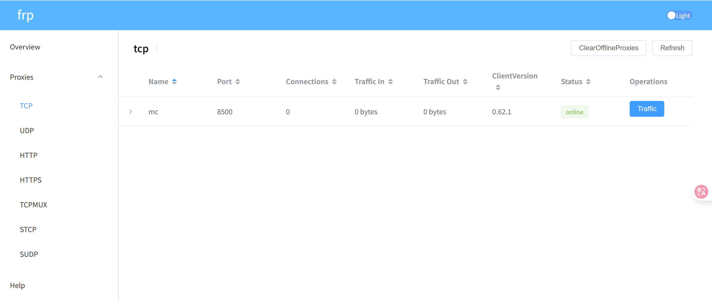

# 内网穿透-frp

> frp相比lanproxy支持多协议高并发访问，还可配置多种加密方式，社区活跃，文档全面，使用go语言编写，兼容性好。但配置较为复杂
<!-- more -->
## 服务端部署

1. 下载frp：https://github.com/fatedier/frp/releases

   ```
   wget https://github.com/fatedier/frp/releases/download/v0.62.1/frp_0.62.1_linux_amd64.tar.gz
   ```

2. 解压并进入文件夹

   ```
   tar -xf frp_0.62.1_linux_amd64.tar.gz
   mv frp_0.62.1_linux_amd64.tar.gz frp
   cd frp
   ```

3. 修改服务端配置文件frps.toml

   ```
   #服务绑定的IP与端口
   bindAddr = "0.0.0.0"
   bindPort = 7000
   #web dashboard配置
   webServer.addr = "0.0.0.0"
   webServer.port = 7500
   webServer.user = "admin"
   webServer.password = "admin"
   #启用prometheus监控指标
   enablePrometheus = true
   #token权限验证，需与客户端配置一致
   auth.method = "token"
   auth.token = "123456"
   #日志配置
   log.to = "/root/frp_0.62.1_linux_amd64/logs/frps.log"
   log.level = "info"
   log.maxDays = 3
   ```

4. 启动frps服务

   > 使用frps启动

   ```
   ./frps -c ./frps.toml
   ```

   > 使用systemctl启动，配置启动文件/etc/systemd/system/frps.service

   ```
   [Unit]
   # 服务名称，可自定义
   Description = frp server
   After = network.target syslog.target
   Wants = network.target
   
   [Service]
   Type = simple
   # 启动frps的命令，需修改为您的frps的安装路径
   ExecStart = /root/frp/frps -c /root/frp/frps.toml
   
   [Install]
   WantedBy = multi-user.target
   ```

## 客户端部署

1. 下载frp

2. 解压并进入文件夹

3. 创建代理配置目录与日志存储目录

   ```
   mkdir logs conf.d
   ```

4. 修改服务端配置文件frpc.toml

   ```
   #配置公网服务器上frp服务的IP与端口
   serverAddr = "x.x.x.x"
   serverPort = 7000
   #web dashboard配置
   webServer.addr = "0.0.0.0"
   webServer.port = 7400
   webServer.user = "admin"
   webServer.password = "admin"
   #日志配置
   log.to = "/Users/mac/frp/logs/frpc.log"
   log.level = "info"
   log.maxDays = 3
   #token权限验证，需与服务端配置一致
   auth.method = "token"
   auth.token = "123456"
   #代理配置，这里使用引用文件的方式
   includes = ["./conf.d/*.toml"]
   ```

5. 添加代理服务，配置conf.d/smb.toml

   ```
   [[proxies]]
   name = "mc"				#名称
   type = "tcp"				#代理类型
   localIP = "127.0.0.1"		#本地IP
   localPort = 25565			#内网服务监听的端口
   remotePort = 8500			#需要在公网服务器上监听的端口
   ```

6. 启动服务

   ```
   ./frpc -c frpc.toml
   ```

7. 成功上线

   