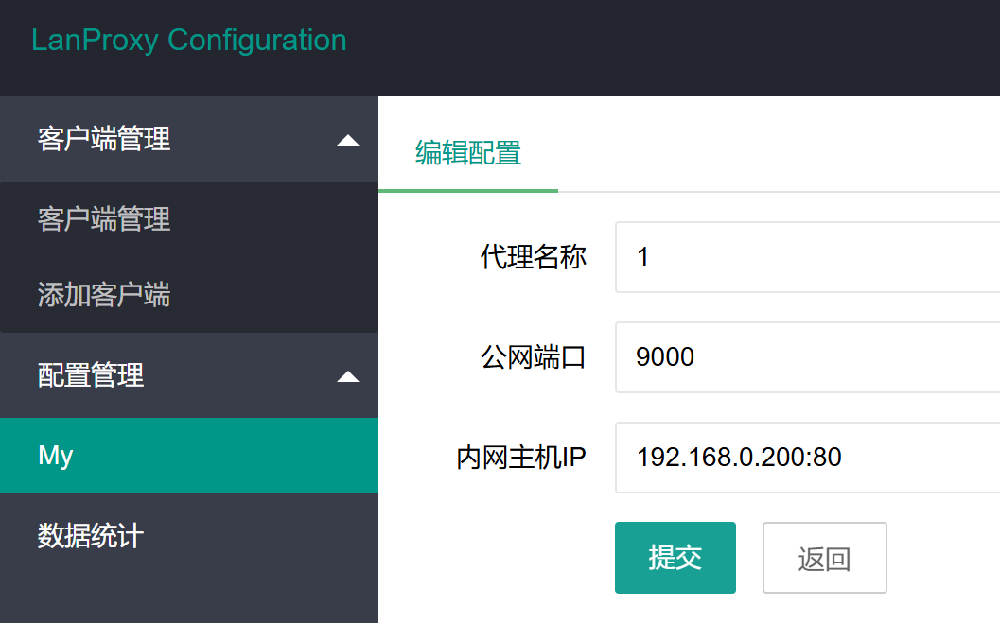

# 内网穿透实验

> 建立与公网与私网的映射，使其它用户可以访问当前局域网主机

<!-- more -->
## 服务端配置

### docker

1. 检查系统内核，docker要求内核大于3.10

   ```bash
   uname -r
   ```

2. 设置阿里云镜像仓库（注意选择自己操作系统对应镜像仓库）

   ```bash
   yum-config-manager --add-repo http://mirrors.aliyun.com/docker-ce/linux/centos/docker-ce.repo
   ```

3. 更新yum软件包索引

   ```bash
   yum makecache fast
   ```

4. 安装docker引擎及扩展组件

   ```bash
   yum install docker-ce docker-ce-cli containerd.io docker-buildx-plugin docker-compose-plugin -y
   ```

5. 设置阿里云源（速度较快）

   ```bash
   mkdir /etc/docker
   tee /etc/docker/daemon.json <<-'EOF'
   {
     "registry-mirrors": ["https://jsodkx19.mirror.aliyuncs.com"]
   }
   EOF
   ```

6. 重新加载配置并启动

   ```bash
   systemctl daemon-reload
   systemctl start docker
   ```

7. 验证docker是否正确安装

   ```
   docker run hello-world
   ```

### Nginx

1. 安装Nginx

   ```bash
   yum install -y nginx
   ```

2. 启动Nginx

   ```bash
   systemctl start nginx
   ```

### lanproxy-server

1. 下载docker镜像

   ```bash
   docker pull franklin5/lanproxy-server
   ```

2. 创建项目文件

   ```bash
   mkdir lanproxy
   cd lanproxy
   ```

3. 编写配置文件docker-compose.yml

   ```
   version: '3.1'
   services:
     lanproxy-client:
       image: franklin5/lanproxy-server
       container_name: lanproxy-server
       environment:
        - LANPROXY_USERNAME=admin
        - LANPROXY_PASSWORD=admin
       ports:
        - 8090:8090
        - 4900:4900
        - 4993:4993
        - 9000-9100:9000-9100
       restart: always
   ```

4. 启动服务

   ```bash
   docker-compose up -d
   ```

5. 防火墙开放相关端口

   

6. 访问8090端口登录

   

7. 添加客户端并生成密钥，密钥后面要用

   

## 客户端配置

### java

1. 下载java开发工具包JDK：https://www.oracle.com/java/technologies/downloads/

2. 安装完成后添加环境变量

   

   

3. 验证环境配置成功

   

### lanproxy-client

1. 下载客户端文件：https://github.com/frank-lam/lanproxy-client

2. 修改配置文件distribution/proxy-client-0.1/conf/config.properties

   

3. 使用Git运行start.sh启动客户端：https://git-scm.com/downloads

   

4. 客户端上线

   

5. 配置映射端口

   

6. 完成配置

   

7. 成功登录本地Web服务

   