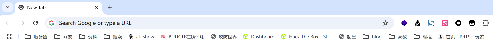

# Chrome书签找回

> 由于更新Chrome失败，于是重新下了一个把旧的卸载了，打开之后发现不对劲，我书签呢！！！

<!-- more -->

Chrome的书签文件名为Bookmarks，使用文件搜索工具很快就能找到该文件，在此推荐一款很好用的工具Listary

https://www.listary.com/

为了找回被删除的书签文件，使用文件恢复工具FinalData
 https://pan.baidu.com/s/1yfs9WZvQ4tGLqYMHQPfXIQ?pwd=i9ej

## 找回删除文件

运行FinalData出现如下界面

选择恢复删除文件，选择删除文件所在驱动器

扫描完成后对需恢复文件进行筛选，文件名可能发生改变，但可根据扩展名和日期查找，还可根据文件路径进一步确认，此处我根据文件名排序确定了区域，再根据文件大小及修改时间锁定目标

选择需要恢复的文件进行恢复，注意不能恢复至原来文件所在分区，避免造成覆盖

## 书签的导入

打开Chrome管理页面导入书签

什么情况，只能导入html文件，于是我将旧书签中内容复制粘贴至新书签中，修改前注意关闭浏览器，对roots中内容进行替换，大功告成

