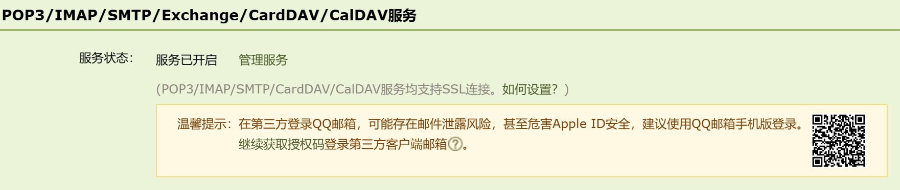

# Linux配置邮箱

> *使服务器具备邮件发送功能*

<!-- more -->

## 安装

```bash
yum -y install mailx
```

## 编辑配置文件

```bash
vim /etc/mail.rc
```

> 在文件末尾添加内容，以QQ邮箱为例：

```bash
#基本配置
set from=temp@qq.com
set smtp=smtps://smtp.qq.com:465
set smtp-auth-user=temp@qq.com
set smtp-auth-password=授权码
set smtp-auth=login
#通过验证
set ssl-verify=ignore
set nss-config-dir=/root/.certs
```

> 由于25端口被封禁，使用TLS方式绕过

### 授权码获取

> 进入QQ邮箱点击设置->账号下拉开启服务，按指示获取授权码



## 生成SSL证书

```bash
mkdir -p /root/.certs/
echo -n | openssl s_client -connect smtp.qq.com:465 | sed -ne '/-BEGIN CERTIFICATE-/,/-END CERTIFICATE-/p' > ~/.certs/qq.crt
certutil -A -n "GeoTrust SSL CA" -t "C,," -d ~/.certs -i ~/.certs/qq.crt
certutil -A -n "GeoTrust Global CA" -t "C,," -d ~/.certs -i ~/.certs/qq.crt
certutil -L -d /root/.certs
```

> 防止出现发送邮件警告

```bash
cd /root/.certs
certutil -A -n "GeoTrust SSL CA - G3" -t "Pu,Pu,Pu" -d ./ -i qq.crt
```

> 返回消息：**Notice: Trust flag u is set automatically if the private key is present.**