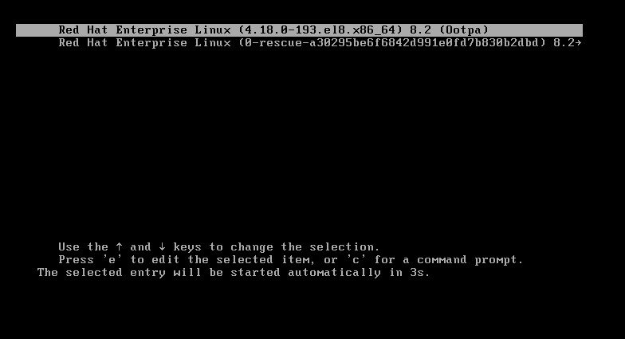
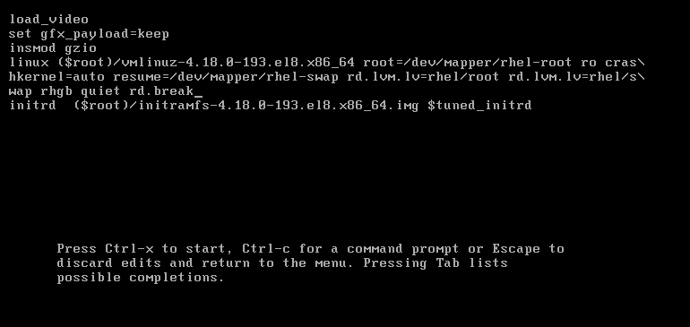
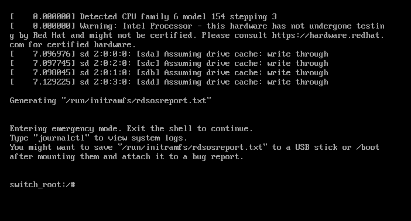

# RHEL8重置root用户密码

<!-- more -->
1. 在启动界面按e进入内核编辑

   

2. 在末尾添加rd.break

   

3. 按Ctrl+x进入救援模式

   

4. 输入以下指令

   ```bash
   mount -o remount,rw /sysroot
   chroot /sysroot
   passwd
   # 输入两次密码
   touch /.autorelabel
   exit
   reboot
   ```

   